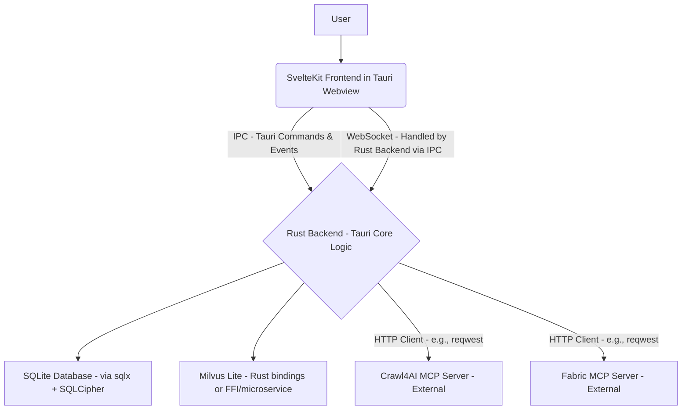
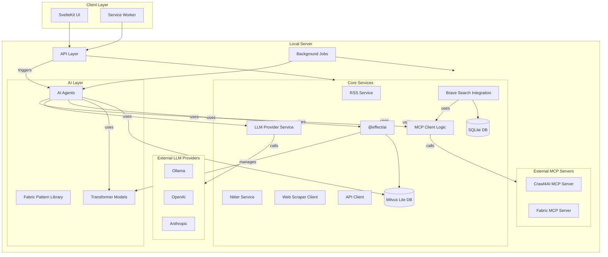
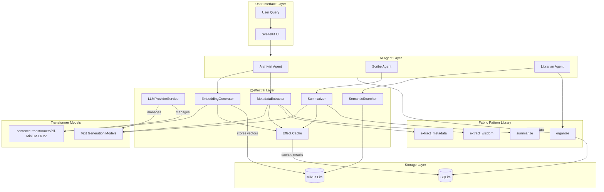

# WebInsight - Detailed Architecture

## Overview

WebInsight leverages the [Fabric pattern library](https://github.com/danielmiessler/fabric/tree/main/patterns) with the Model Context Protocol (MCP) for intelligent content processing, transforming aggregated web content into actionable insights. It integrates transformer models for embedding generation and text processing, managed by **@effect/ai** for LLM interactions, while specialized tools like Crawl4AI are exposed via MCP. The application implements a central MCP host that serves as a registry for providers, with the Crawl4AI MCP provider offering standardized access to web content extraction capabilities. For vector storage and similarity search, WebInsight uses Milvus Lite, a lightweight vector database that complements SQLite for efficient embedding operations. Built with Bun and SvelteKit, this local-first application prioritizes privacy and user control while following functional programming principles (pure functions, immutable data structures, declarative patterns) to create a robust platform for insight generation. Its core architecture is deeply rooted in functional programming principles, utilizing **Effect TS** extensively for managing complexity, ensuring type safety, handling side effects, and composing business logic in a declarative and robust manner.

## Programming Paradigm

### Functional Programming with Effect TS

WebInsight embraces functional programming, with Effect TS serving as the backbone for managing effects, concurrency, resources, and application structure. This approach aims for:

- **Declarative Business Logic**: Expressing _what_ needs to happen rather than _how_, using Effect's combinators to build complex workflows from smaller, reusable effects.
- **Robust Error Handling**: Leveraging Effect's typed error channels (`Effect<A, E, R>`) to explicitly handle potential failures at the type level, eliminating runtime exceptions for expected errors.
- **Resource Safety**: Utilizing `Scope` and `Layer` to ensure resources (database connections, file handles, network requests) are acquired and released safely, preventing leaks.
- **Asynchronous & Concurrent Operations**: Managing asynchronous tasks and concurrency with powerful primitives like Fibers, ensuring responsiveness and efficient resource utilization.
- **Dependency Management**: Using `Context` and `Layer` for modular and type-safe dependency injection.
- **Caching & Performance Optimization**: Utilizing `Effect.Cache` for type-safe, efficient caching of AI-generated outputs in the hybrid CAG/RAG strategy.

```typescript
// Example: Effect-based content transformation using Layer for dependencies
import { Effect, Layer, Context, pipe } from 'effect';
import * as Schema from '@effect/schema/Schema';

// Define Service Interfaces (Context Tags)
class MCPService extends Context.Tag('MCPService')<
	MCPService,
	{
		readonly executePattern: (
			pattern: string,
			input: unknown,
			target: string
		) => Effect.Effect<unknown, MCPError>;
	}
>() {}
class ContentDB extends Context.Tag('ContentDB')<
	ContentDB,
	{
		readonly saveArticle: (article: Article) => Effect.Effect<void, DBError>;
	}
>() {}

// Define Data Schema with @effect/schema
const ArticleSchema = Schema.Struct({
	id: Schema.String,
	title: Schema.String,
	rawContent: Schema.String,
	summary: Schema.Option(Schema.String)
});
type Article = Schema.Schema.To<typeof ArticleSchema>;

// Business Logic composed with Effect
const transformAndSaveContent = (
	rawContent: string
): Effect.Effect<Article, MCPError | DBError, MCPService | ContentDB> =>
	Effect.gen(function* (_) {
		const mcp = yield* _(MCPService);
		const db = yield* _(ContentDB);
		const title = extractTitle(rawContent); // Assume pure helper function
		const summaryResult = yield* _(mcp.executePattern('summarize', rawContent, 'mcp://default'));
		const summary = yield* _(Schema.decode(Schema.String)(summaryResult)); // Validate MCP output

		const article: Article = {
			id: generateId(), // Assume pure helper function
			title,
			rawContent,
			summary: Option.some(summary)
		};

		yield* _(db.saveArticle(article));
		return article;
	});

// Example Layer providing live implementation
const MCPServiceLive = Layer.succeed(MCPService, {
	executePattern: (pattern, input, target) => Effect.succeed(`Summary of ${input}`)
});

// Running the effect with dependencies provided
const runnable = transformAndSaveContent('Some raw text...').pipe(
	Effect.provideLayer(MCPServiceLive)
	// pipe(Effect.provideLayer(ContentDBLive)) // Provide DB Layer elsewhere
);

// Example of function composition (conceptual)
const processArticle = pipe(
	fetchContent, // Effect<RawContent, HttpError, HttpClient>
	parseContent, // Effect<ParsedData, ParseError, ParserService>
	transformAndSaveContent, // Effect<Article, MCPError | DBError, MCPService | ContentDB>
	storeContent // Effect<void, DbError, DbService>
);

const addArticleToCollection = (collection, article) => ({
	...collection,
	articles: [...collection.articles, article.id]
});
```

### Core Principles

- **Pure Functions**: Side-effect free functions, utilizing Effect for managing and isolating effects
- **Immutability**: Unchanging data structures, with Effect ensuring immutability in state transformations
- **Function Composition**: Complex operations built by composing Effect-based pipelines
- **Higher-Order Functions**: Leveraging Effect's combinators for advanced control flow and error handling
- **Declarative Style**: Expressing intent through Effect's declarative API and combinators

### Effect TS Core Principles Applied

- **Type-Safe Error Handling**: Using Effect's typed error channel for comprehensive error management
- **Resource Safety**: Employing Effect's Scope and Layer for safe resource acquisition and release
- **Dependency Injection**: Utilizing Effect's Context and Layer for modular and testable code structure
- **Concurrency Management**: Harnessing Effect's Fiber system for efficient asynchronous operations
- **Testability**: Leveraging Effect's pure nature for easier unit testing and mocking of dependencies

## System Architecture

### Alternative Framework Consideration: Tauri

While the primary architecture for WebInsight is based on SvelteKit + Bun, providing a unified TypeScript full-stack environment, an alternative framework, Tauri, is under consideration for future phases (specifically Phase 5: Distribution & Polish).

Tauri is a framework for building lightweight, cross-platform desktop applications using web technologies (like SvelteKit for the frontend) and a Rust backend. This approach offers several potential advantages:

- **Reduced Application Size:** Tauri apps are typically much smaller as they leverage the operating system's native webview.
- **Performance Enhancements:** Rust's performance can be beneficial for CPU-intensive backend tasks, including AI processing and data manipulation.
- **Security Benefits:** Rust's memory safety features can enhance the overall security of the application.

In a Tauri-based architecture for WebInsight:

- The **frontend** would continue to be built with SvelteKit, rendered within Tauri's native webview.
- The **backend** logic, currently in TypeScript (Effect TS), would be rewritten in Rust. This includes services like the `FeedService`, `HybridCAGService`, and interactions with the `Crawl4AI MCP Server` and `Fabric MCP Server`.
- Communication between the SvelteKit frontend and the Rust backend would occur via **Inter-Process Communication (IPC)**, managed by Tauri, instead of SvelteKit's API routes or WebSocket handlers directly tied to the Node.js/Bun runtime.
- Database interactions (SQLite with SQLCipher) would be handled by Rust ORMs or query builders (e.g., `sqlx`).
- AI components like Milvus Lite would require Rust bindings or be accessed via FFI/microservices.

The following diagram illustrates a conceptual Tauri-based architecture for WebInsight:



This shift would represent a significant architectural change, moving from a JavaScript/TypeScript monolithic (or integrated full-stack) approach to a dual-stack model with distinct frontend and backend language ecosystems. The evaluation is primarily focused on leveraging Rust's strengths for performance-critical operations and Tauri's capabilities for efficient application packaging and distribution.

### Core Architecture Layers

### 1. Frontend Layer (SvelteKit)

#### Components Structure

```plaintext
src/
├── lib/
│   ├── components/
│   │   ├── ui/              # shadcn-svelte components
│   │   │   ├── button/
│   │   │   ├── card/
│   │   │   └── ...
│   │   ├── feed/
│   │   │   ├── FeedList.svelte
│   │   │   ├── FeedItem.svelte
│   │   │   ├── FeedReader.svelte
│   │   │   └── FeedCollection.svelte
│   │   ├── content/
│   │   │   ├── ArticleView.svelte
│   │   │   ├── ContentCard.svelte
│   │   │   ├── TagList.svelte
│   │   │   └── ContentFilter.svelte
│   │   └── ai/
│   │       ├── AIInsights.svelte
│   │       ├── SummaryView.svelte
│   │       ├── RecommendationList.svelte
│   │       └── LLMManager.svelte  # New component for LLM provider configuration
│   ├── server/
│   │   ├── db/
│   │   │   ├── schema/
│   │   │   └── migrations/
│   │   ├── ai/
│   │   │   ├── archivist.ts
│   │   │   ├── scribe.ts
│   │   │   ├── librarian.ts
│   │   ├── mcp/              # MCP integration
│   │   │   ├── host.ts         # MCP host implementation
│   │   │   └── crawl4ai/       # Crawl4AI MCP provider
│   │   │       ├── index.ts      # Provider exports
│   │   │       ├── service.ts    # Provider implementation
│   │   │       ├── schemas.ts    # Data schemas
│   │   │       ├── errors.ts     # Error types
│   │   │       └── provider.ts   # Provider adapter
│   │   ├── rss/
│   │   │   ├── parser.ts
│   │   │   └── fetcher.ts
│   │   ├── scraper/
│   │   │   ├── crawler.ts
│   │   │   └── parser.ts
│   │   ├── api/
│   │   │   ├── client.ts
│   │   │   └── sources/
│   │   └── nitter/
│   │       ├── service.ts
│   │       └── instances.ts
│   ├── stores/
│   │   ├── feeds.ts
│   │   ├── articles.ts
│   │   ├── collections.ts
│   │   ├── ui.ts
│   │   └── preferences.ts
│   ├── utils/
│   │   ├── date.ts
│   │   ├── text.ts
│   │   ├── url.ts
│   │   └── functional.ts
│   └── types/
│       ├── feed.ts
│       ├── article.ts
│       ├── collection.ts
│       └── api.ts
├── routes/
│   ├── +page.svelte
│   ├── feeds/
│   ├── articles/
│   ├── collections/
│   ├── settings/
│   └── api/
└── static/
    ├── icons/
    └── images/
```

#### Key Frontend Features

- Server-side rendering with SvelteKit
- Reactive state management using Svelte stores
- Functional reactive programming patterns
- Immutable state transformations
- WebSocket integration for real-time updates including MCP status
- Service Workers for offline functionality
- Dark mode support via Tailwind CSS
- Responsive design using shadcn-svelte components
- Declarative UI components with LLM provider management

### 2. Backend Layer (Bun + SvelteKit)

#### Hybrid CAG/RAG Strategy

WebInsight implements a hybrid Cache-Augmented Generation (CAG) and Retrieval-Augmented Generation (RAG) strategy using Effect.Cache to optimize AI operations:

- **Cache-Augmented Generation (CAG)**: Caches AI-generated outputs (summaries, recommendations, metadata) to reduce redundant computations and improve response times.
- **Retrieval-Augmented Generation (RAG)**: Retrieves relevant content from the local database to provide context for AI generation, improving output quality and relevance.
- **Implementation**: Uses `Effect.Cache` with type-safe key/value storage, configurable TTL, and metadata-based context retrieval.

```typescript
// Example: HybridCAGService using Effect.Cache
interface HybridCAGService {
	getOrGenerate: (
		articleId: string,
		queryType: 'summary' | 'recommendation' | 'metadata',
		context?: string[]
	) => Effect.Effect<string, Error, Database | FabricAI>;
}

// Cache implementation with Effect.Cache
const cache = Cache.make({
	lookup: (key) => retrieveOrGenerateContent(key),
	capacity: 1000,
	timeToLive: '1 day'
});
```

The hybrid approach follows a workflow that checks the cache first, then retrieves context if needed, and finally generates new content, ensuring optimal performance without compromising quality.

#### Server Structure

```plaintext
src/
├── routes/
│   ├── api/              # API endpoints
│   │   ├── feeds/        # Feed operations
│   │   ├── content/      # Content operations
│   │   └── ai/           # AI agent endpoints with MCP
│   └── +layout.svelte    # Root layout
├── lib/
│   └── server/           # Server-side logic
```

#### Core Services

1. **Feed Service**: Handles RSS/Atom feed fetching and parsing.
2. **MCP Architecture**:

   - **MCP Host**: Central registry for MCP providers that routes tool calls to the appropriate provider.
     - Implements provider registration and discovery mechanisms.
     - Provides unified API for tool discovery and execution.
     - Handles errors consistently across providers.
   - **Crawl4AI MCP**: MCP host and client implementation.
     - **Crawl4AI MCP Provider**: Implements the MCP provider interface for the Crawl4AI service.
       - Exposes web content extraction capabilities as standardized MCP tools.
       - Implements robust error handling with Effect TS.
       - Validates inputs and outputs with Effect Schema.
     - **MCP-based Crawl4AI Client**: Client that uses the MCP infrastructure to access Crawl4AI capabilities.
       - Maintains the same API as the original client for backward compatibility.
       - Leverages the MCP infrastructure for standardized access.

   ```typescript
   // Implemented MCP host and provider architecture
   interface MCPHostService {
   	// Register a provider with the host
   	registerProvider(provider: MCPProvider): Effect.Effect<void, MCPHostError>;
   	// List all tools from all providers
   	listAllTools(): Effect.Effect<Array<MCPTool>, MCPHostError>;
   	// Call a tool by name and provider
   	callTool<P, R>(
   		toolName: string,
   		providerName: string,
   		params: P
   	): Effect.Effect<R, MCPHostError | ServiceError>;
   }

   // Crawl4AI MCP provider implementation
   interface Crawl4AIService {
   	// Extract content from a web page
   	extractContent(
   		params: ExtractContentInput
   	): Effect.Effect<ExtractContentOutput, Crawl4AIMCPError>;
   	// Check if scraping is allowed by robots.txt
   	checkRobotsTxt(
   		params: CheckRobotsTxtInput
   	): Effect.Effect<CheckRobotsTxtOutput, Crawl4AIMCPError>;
   	// List available MCP tools
   	listTools(): Effect.Effect<Array<Tool>, Crawl4AIMCPError>;
   	// Call a tool by name
   	callTool<P, R>(name: string, params: P): Effect.Effect<R, Crawl4AIMCPError>;
   }
   ```

3. **RSS Service with Nitter Integration**

   - RSS feed fetching and parsing
   - Nitter instance management for X content
     - Instance cycling and fallback mechanism
     - Instance health monitoring
   - **Dependency Injection**: Provided as a `Layer`.
   - Local caching of feed content
   - Feed validation and error recovery

4. **API Client Service with MCP**

   - Configurable API source management via MCP
   - Support for various API services (X, GitHub, Reddit, etc.)
   - Secure credential storage
   - Rate limit management
   - **Dependency Injection**: Provided as a `Layer`, depends on `HttpClient` and potentially `EncryptionService` layers.
   - Response parsing and normalization with MCP patterns

   ```typescript
   interface ApiClientService {
   	configureMCPConnection(config: MCPConfig): Promise<MCPConnection>;
   	fetchFromEndpoint(source: ApiSource, endpoint: string, params: object): Promise<ApiResponse>;
   	handleRateLimits(source: ApiSource): Promise<RateLimitInfo>;
   	parseResponse(response: ApiResponse): Promise<ParsedContent>;
   }

   interface MCPConfig {
   	vendor: string; // e.g., ollama, openai
   	model: string;
   	url: string; // e.g., mcp://localhost:11434/llama2
   	credentials?: Credentials;
   }
   ```

5. **Background Job Service**
   - Feed update scheduling
   - API request scheduling (respecting rate limits)
   - Content processing queue with MCP pipelines
   - AI task management via MCP
   - System maintenance tasks
   - Cache management (invalidation, refresh)
   - Context retrieval optimization
   - **Dependency Injection**: Provided as a `Layer`, orchestrates other service layers.

### 3. AI Layer (Fabric Pattern Library + Transformers + @effect/ai + MCP)

#### Agent Architecture

1. **The Archivist**:

   - Responsible for content collection and metadata extraction.
   - **Uses the Feed Service for RSS/Atom feeds.**
   - **Uses the Crawl4AI MCP Server (via the backend MCP client) for scraping web pages.**
   - Executes Fabric pattern library operations (e.g., `extract_metadata`) via MCP to enrich content.
   - Uses transformer models (e.g., sentence-transformers/all-MiniLM-L6-v2) for embedding generation, managed by @effect/ai.
   - Stores embeddings in Milvus Lite for efficient similarity search.
   - May trigger Brave Search Integration for additional context.

   ```typescript
   // Conceptual interface
   interface ArchivistAgent {
   	collectFromUrl(url: string): Promise<Content>;
   	enrichMetadata(contentId: string): Promise<Metadata>;
   }
   ```

2. **The Scribe**:

   - Executes Fabric pattern library operations (e.g., `summarize`) via MCP
   - Uses transformer models for text generation tasks like summarization and metadata extraction
   - Managed by @effect/ai as pure functions with type safety and error handling
   - Analyzes content for insights using transformer-based semantic understanding

   ```typescript
   interface ScribeAgent {
   	summarizeContent(content: Content): Promise<Summary>;
   	extractKeyPoints(content: Content): Promise<KeyPoint[]>;
   	analyzeSentiment(content: Content): Promise<SentimentAnalysis>;
   	assessQuality(content: Content): Promise<QualityScore>;
   }
   ```

3. **The Librarian**:

   - Generates recommendations based on user preferences and content analysis
   - Creates cross-references between content pieces
   - Suggests organization for collections
   - Leverages transformer-generated embeddings stored in Milvus Lite for semantic similarity search
   - Implements advanced recommendation algorithms using @effect/ai for functional composition

   ```typescript
   interface LibrarianAgent {
   	generateRecommendations(userPrefs: UserPreferences): Promise<Recommendation[]>;
   	createCrossReferences(content: Content[]): Promise<Reference[]>;
   	suggestOrganization(collections: Collection[]): Promise<OrganizationSuggestion>;
   }
   ```

### 4. Data Layer

#### Database Schema (SQLite + Milvus Lite + Drizzle ORM)

#### Profile-Specific Database Architecture

- **Model**: Each user profile corresponds to a separate SQLite database file (e.g., `~/.config/webinsights/profiles/<profile_id>.db`), enabling strong data isolation.
- **Storage**: Profile databases are stored in a dedicated directory within the application's data folder.
- **Metadata**: A central mechanism (e.g., `profiles.json` or a separate small `metadata.db`) stores profile metadata, including the path to the profile's database file and its encryption status (public/private).

#### Optional Encryption (SQLCipher)

- **Privacy Choice**: Users can designate a profile as private during creation, triggering database encryption.
- **Mechanism**: Private profile databases are encrypted using SQLCipher (via `better-sqlite3-sqlcipher` binding), providing full database file AES-256 encryption.
- **Key Management**: The encryption key for a private profile is derived from a user-provided password using a strong key derivation function (e.g., PBKDF2). The password is required each time the private profile is loaded.

#### Connection Management

- **Dynamic Connections**: Database connections are established dynamically based on the currently selected profile.
- **Conditional Driver**: The application uses the standard `better-sqlite3` driver for public profiles and the `better-sqlite3-sqlcipher` driver for private profiles.
- **Key Provision**: For private profiles, the derived encryption key is provided to SQLCipher (`PRAGMA key = '...'`) immediately after establishing the connection.

#### Database Schema (Per-Profile)

The following schema applies individually to _each_ profile's database file.

```typescript
// Feed Table
interface Feed {
	id: string;
	url: string;
	title: string;
	description: string;
	lastUpdated: Date;
	updateFrequency: number;
	status: FeedStatus;
	type: FeedType;
	sourceConfig: SourceConfig;
}

// Article Table
interface Article {
	id: string;
	feedId: string;
	title: string;
	content: string;
	publishDate: Date;
	metadata: ArticleMetadata;
	aiAnalysis: AIAnalysis;
	originalSource: string;
	embeddingId: string; // Reference to embedding vector in Milvus Lite
}

// Collection Table
interface Collection {
	id: string;
	name: string;
	description: string;
	articles: string[];
	tags: string[];
	createdAt: Date;
	updatedAt: Date;
}

// Cached Results Table (for CAG/RAG strategy)
interface CachedResult {
	id: string;
	articleId: string;
	queryType: 'summary' | 'recommendation' | 'metadata';
	result: string;
	timestamp: number;
	ttl: number;
}

// User Preferences Table
interface UserPreferences {
	id: string;
	theme: Theme;
	readingSettings: ReadingSettings;
	feedSettings: FeedSettings;
	aiSettings: AISettings;
	uiSettings: UISettings;
	scrapingSettings: ScrapingSettings;
	llmSettings: LLMSettings; // Added for LLM provider configuration
}

// API Source Table
interface ApiSource {
	id: string;
	name: string;
	baseUrl: string;
	authType: AuthType;
	encryptedCredentials: string;
	endpoints: ApiEndpoint[];
	rateLimits: RateLimit[];
	lastUsed: Date;
}

// Nitter Instance Table
interface NitterInstance {
	id: string;
	url: string;
	status: InstanceStatus;
	lastChecked: Date;
	successRate: number;
	quirks: InstanceQuirk[];
}

// MCP Connection Table
interface MCPConnection {
	id: string;
	url: string; // e.g., mcp://localhost:11434/llama2
	vendor: string; // e.g., ollama, openai
	model: string;
	status: ConnectionStatus;
}
```

#### Storage Strategy

- **Validation**: Uses `@effect/schema` for defining and validating all core data structures (Feed, Article, Collection, etc.) fetched from or saved to the database, replacing Zod.
- SQLite for structured data within each profile's database.
- File system for content cache
- In-memory cache for frequent access
- Automatic backups
- Data Migrations (On-Profile Load):
  - Migrations are managed using Drizzle ORM schema definitions but applied via a custom process.
  - Standard Drizzle `migrate` function is NOT used directly due to the multi-database nature.
  - **Process**: When a specific profile database (public or private) is loaded:
    1. Check the database's internal migration history table (`__drizzle_migrations`).
    2. Compare applied migrations against the migration files (`migrations/*.sql`) defined in the codebase.
    3. Identify and apply any pending `.sql` migration files sequentially.
    4. Update the profile database's migration history table.
  - **Error Handling**: The migration process for each profile is wrapped in an `Effect`, allowing for robust, functional error handling and recovery strategies.
- Query optimization
- Local caching of API responses and MCP outputs

### 5. Integration Layer

Interactions via this layer leverage Effect for managing asynchronous communication and errors.

#### WebSocket Communication

```typescript
interface WebSocketEvents {
	'feed:update': (feedId: string) => void;
	'content:new': (articleId: string) => void;
	'collection:update': (collectionId: string) => void;
	'ai:insight': (insightId: string) => void;
	'mcp:update': (connectionId: string) => void;
}
```

#### Background Jobs

```typescript
interface JobScheduler {
	scheduleFeedUpdates(): void;
	scheduleContentProcessing(): void;
	scheduleApiRequests(): void;
	scheduleMaintenanceTasks(): void;
	scheduleMCPTasks(): void; // Added for MCP server management
}
```

## Security Architecture

### Data Protection

1. **Local Storage Security**

   - Encrypted sensitive data including MCP credentials
   - Secure configuration storage
   - Access control mechanisms for MCP servers
   - Optional, robust full-database encryption for private profiles via SQLCipher.
   - **Encryption Service**: An Effect `Layer` responsible for handling password hashing (PBKDF2) and potentially credential encryption/decryption.
   - Password-based key derivation for private profile decryption.

2. **Privacy Measures**
   - No external data sharing by default
   - Local-only processing with MCP
   - User data control over MCP configurations

## Performance Optimization

### Functional Approach to Performance

1. **Memoization for Expensive Operations**

   ```typescript
   // Memoized function example with MCP
   const memoizedAnalyze = memoize(
   	(content: Content): Analysis =>
   		mcp.executePattern('analyze', content, 'mcp://localhost:11434/llama2'),
   	(content) => content.id
   );
   ```

2. **Lazy Evaluation**

   ```typescript
   // Lazy sequence processing with MCP
   const processArticles = pipe(
   	lazyMap(fetchMetadata),
   	lazyFilter(isRelevant),
   	lazyMap(transformContentWithMCP(['extract_wisdom', 'summarize'])),
   	take(10)
   );
   ```

### Caching Strategy

1. **Multi-level Cache with Immutable Data**

   ```typescript
   interface CacheManager {
   	memory: MemoryCache;
   	disk: DiskCache;
   	feed: FeedCache;
   	apiResponse: ApiResponseCache;
   	scrapedContent: ScrapedContentCache;
   	llmCache: LLMCache; // Added for LLM provider outputs
   	set: <T>(key: string, value: T) => CacheManager;
   	get: <T>(key: string) => Option<T>;
   }
   ```

2. **Resource Management**
   - Memory usage monitoring
   - Disk space management
   - Background task scheduling with MCP
   - Adjustable AI processing depth via MCP UI
   - Resource-aware operation modes
   - Performance profiles for different hardware capabilities
   - Efficient immutable data structures

### Query Optimization

- Indexed database fields including MCP connections
- Query result caching
- Batch processing with MCP pipelines

## Error Handling

### Recovery System

```typescript
interface ErrorHandler {
	handleNetworkError(error: NetworkError): Promise<void>;
	handleDatabaseError(error: DatabaseError): Promise<void>;
	handleAIError(error: AIError): Promise<void>;
	handleMCPError(error: MCPError): Promise<void>; // Added for MCP-specific errors
}
```

### Logging System

```typescript
interface Logger {
	info(message: string, context?: object): void;
	error(error: Error, context?: object): void;
	warn(message: string, context?: object): void;
	debug(message: string, context?: object): void;
}
```

## Development Workflow

### Functional Programming Guidelines

+- **Embrace Effect**: Structure application logic primarily using Effect data types and combinators.

- Prefer pure functions over methods with side effects
- Use immutable data structures (arrays, objects) with spread operators
- Leverage function composition for complex operations with MCP
- Utilize higher-order functions (map, filter, reduce) over imperative loops
- Separate data from behavior
- Handle side effects explicitly and at the edges of the system
- Implement error handling with functional patterns (Option, Either, etc.)
  +- **Dependency Management**: Define services using `Context.Tag` and compose the application using `Layer`.

### Project Setup

```bash
# Install dependencies
bun install

# Development server
bun run dev

# Build
bun run build

# Test
bun run test
```

### Testing Strategy

1. **Unit Tests**

   - Component testing including MCP UI
   - Service testing with MCP integration
   - AI agent testing with Fabric patterns
   - MCP connection testing

2. **Integration Tests**

   - API endpoint testing with MCP
   - Data flow testing through MCP pipelines
   - UI interaction testing with MCP configuration

3. **E2E Tests**
   - User workflow testing with MCP-enabled features
   - Performance testing
   - Offline functionality testing

## Deployment Architecture

### Local Deployment

1. **Installation Process**

   - Dependencies check
   - Database initialization with MCP schema
   - Configuration setup including MCP servers and LLM providers

2. **Update Mechanism**
   - Version checking
   - Incremental updates
   - Rollback capability

## Monitoring and Maintenance

### System Health

```typescript
interface HealthCheck {
	checkDatabase(): Promise<HealthStatus>;
	checkAIServices(): Promise<HealthStatus>;
	checkNetworkServices(): Promise<HealthStatus>;
	checkFileSystem(): Promise<HealthStatus>;
	checkMCPServers(): Promise<HealthStatus>; // Added for MCP monitoring
}
```

### Performance Metrics

```typescript
interface Metrics {
	collectPerformanceMetrics(): Promise<PerformanceData>;
	monitorResourceUsage(): Promise<ResourceUsage>;
	trackUserInteractions(): Promise<UserMetrics>;
	measureResponseTimes(): Promise<ResponseTimeMetrics>;
	trackMCPPerformance(): Promise<MCPMetrics>; // Added for MCP-specific metrics
}
```

## Future Considerations

### Scalability

- Modular AI agent system with MCP
- Pluggable service architecture
- Extensible data models with MCP support

### Planned Features

- Enhanced offline support
- Advanced API integration capabilities with MCP
- Configurable scraping rules UI
- Performance optimization for low-end hardware with MCP adjustments
- Adjustable AI processing depth via MCP UI
- Multi-service API integration framework
- Advanced AI capabilities with Fabric pattern updates
- Improved content discovery
- Extended customization options with MCP

### High-Level System Architecture



### AI Agent Interaction with @effect/ai



**Note on Diagram:**

- **Web Scraper Client**: Represents the service logic within the SvelteKit backend that initiates scraping requests.
- **MCP Client Logic**: Represents the backend's capability to act as a client to specialized MCP servers like Crawl4AI.
- **LLM Provider Service**: Represents the @effect/ai-based service for interacting with LLM providers in a provider-agnostic way.
- **External MCP Servers**: Represents the standalone MCP servers for specialized tools, including the refactored Crawl4AI MCP Server and Fabric.
- **External LLM Providers**: Represents the LLM providers (OpenAI, Anthropic, Ollama) that the LLM Service connects to through @effect/ai adapters.
