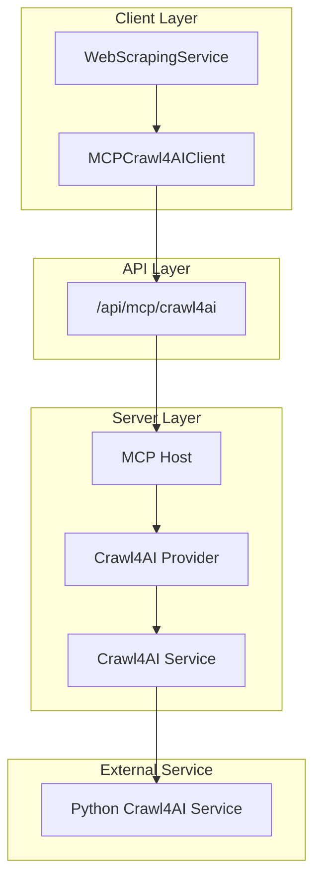

# Crawl4AI MCP Implementation

## Overview

The Crawl4AI MCP implementation is a core component of WebInsight that provides web content extraction capabilities through the Model Context Protocol (MCP) architecture. This document details the design, implementation, and usage of the Crawl4AI MCP provider and client, which together enable standardized access to web scraping functionality while following WebInsight's functional programming principles with Effect TS.

## Architecture

The Crawl4AI MCP implementation follows a layered architecture that separates concerns and promotes maintainability:



### Key Components

1. **MCPCrawl4AIClient**: Client-side interface that applications use to access Crawl4AI capabilities.
2. **API Endpoints**: SvelteKit API routes that expose the MCP functionality.
3. **MCP Host**: Central registry that manages providers and routes requests.
4. **Crawl4AI Provider**: MCP provider implementation that registers tools and resources.
5. **Crawl4AI Service**: Core service that communicates with the external Python service.
6. **External Python Service**: Standalone service that performs the actual web scraping.

## Implementation Details

### Client Implementation (MCPCrawl4AIClient)

The `MCPCrawl4AIClient` provides a type-safe, Effect-based interface for accessing Crawl4AI capabilities:

```typescript
export class MCPCrawl4AIClient {
  // Use the Crawl4AI-specific MCP API route
  private static readonly MCP_API_URL = '/api/mcp/crawl4ai';

  /**
   * Extract content from a URL using Crawl4AI via MCP API route
   */
  static extractContent(
    options: ExtractionOptions
  ): Effect.Effect<ExtractionResponse, ServiceError> {
    // Implementation using Effect TS for robust error handling and validation
  }

  /**
   * Check if a URL is allowed by robots.txt using Crawl4AI via MCP API route
   */
  static checkRobotsTxt(
    url: string,
    userAgent?: string
  ): Effect.Effect<RobotsCheckResponse, ServiceError> {
    // Implementation using Effect TS for robust error handling and validation
  }
}
```

Key features of the client implementation:

- **Effect-Based API**: Uses Effect TS for functional error handling and type safety.
- **Schema Validation**: Validates inputs using Effect Schema before making API calls.
- **Comprehensive Error Handling**: Maps different error types to appropriate ServiceError instances.
- **Standardized Interface**: Provides a consistent API regardless of the underlying implementation.

### MCP Provider Implementation

The Crawl4AI MCP provider implements the MCP protocol for web content extraction:

```typescript
export class Crawl4AIMCPProvider implements MCPProvider {
  /**
   * List available tools provided by this provider
   */
  listTools(): Effect.Effect<Tool[], Crawl4AIMCPError> {
    // Returns available tools like extractContent and checkRobotsTxt
  }

  /**
   * Call a tool by name with parameters
   */
  callTool<P, R>(name: string, params: P): Effect.Effect<R, Crawl4AIMCPError> {
    // Routes the call to the appropriate tool implementation
  }
}
```

The provider registers the following tools:

1. **extractContent**: Extracts content from a web page with options for format and metadata.
2. **checkRobotsTxt**: Checks if a URL is allowed by the site's robots.txt file.

### Service Implementation

The core service implementation handles the communication with the external Python service:

```typescript
export class Crawl4AIService {
  /**
   * Extract content from a web page
   */
  extractContent(
    params: ExtractContentInput
  ): Effect.Effect<ExtractContentOutput, Crawl4AIMCPError> {
    // Communicates with the Python service and handles errors
  }

  /**
   * Check if a URL is allowed by robots.txt
   */
  checkRobotsTxt(
    params: CheckRobotsTxtInput
  ): Effect.Effect<CheckRobotsTxtOutput, Crawl4AIMCPError> {
    // Communicates with the Python service and handles errors
  }
}
```

### Error Handling

The implementation uses Effect TS for comprehensive error handling:

```typescript
export class Crawl4AIMCPError extends Data.TaggedError('Crawl4AIMCPError')<{
  readonly code: string;
  readonly message: string;
  readonly cause?: unknown;
}> {}
```

Error types include:

- **INVALID_PARAMETERS**: Input validation errors.
- **NETWORK_ERROR**: Communication errors with the Python service.
- **TIMEOUT_ERROR**: Request timeout errors.
- **SERVICE_UNAVAILABLE**: Service availability errors.
- **ROBOTS_DENIED**: Access denied by robots.txt.
- **EXTRACT_CONTENT_ERROR**: Content extraction errors.
- **CHECK_ROBOTS_TXT_ERROR**: Robots.txt checking errors.

## Testing

The Crawl4AI MCP implementation includes comprehensive testing:

1. **Unit Tests**: Test individual components in isolation with mocked dependencies.
2. **Integration Tests**: Test the end-to-end flow from client to service.

Key testing aspects:

- **Mock Response Objects**: Properly simulate Response objects with json() method.
- **Effect Testing**: Use Effect TS testing utilities for testing effects.
- **Error Scenarios**: Test various error conditions and recovery mechanisms.
- **Validation Testing**: Ensure input validation works correctly.

## Usage Examples

### Basic Content Extraction

```typescript
import { Effect } from 'effect';
import { MCPCrawl4AIClient } from '$lib/services/scraper/MCPCrawl4AIClient';

// Extract content from a URL
const result = await Effect.runPromise(
  MCPCrawl4AIClient.extractContent({
    url: 'https://example.com',
    mode: 'markdown',
    includeMetadata: true
  })
);

console.log('Content:', result.content);
console.log('Metadata:', result.metadata);
```

### Checking Robots.txt Compliance

```typescript
import { Effect } from 'effect';
import { MCPCrawl4AIClient } from '$lib/services/scraper/MCPCrawl4AIClient';

// Check if a URL is allowed by robots.txt
const result = await Effect.runPromise(
  MCPCrawl4AIClient.checkRobotsTxt('https://example.com', 'WebInsight Bot')
);

if (result.allowed) {
  console.log('URL is allowed by robots.txt');
} else {
  console.log('URL is not allowed by robots.txt:', result.message);
}
```

### Advanced Error Handling Examples

```typescript
import { Effect } from 'effect';
import { MCPCrawl4AIClient } from '$lib/services/scraper/MCPCrawl4AIClient';
import { ServiceError } from '$lib/utils/effect';

// Extract content with error handling
const program = MCPCrawl4AIClient.extractContent({
  url: 'https://example.com',
  mode: 'markdown',
  includeMetadata: true
}).pipe(
  Effect.catchTag('ServiceError', (error) => {
    if (error.code === 'TIMEOUT_ERROR') {
      console.error('Request timed out:', error.message);
    } else if (error.code === 'NETWORK_ERROR') {
      console.error('Network error:', error.message);
    } else {
      console.error('Service error:', error.code, error.message);
    }
    return Effect.fail(error);
  })
);

try {
  const result = await Effect.runPromise(program);
  console.log('Content extracted successfully:', result);
} catch (error) {
  console.error('Failed to extract content:', error);
}
```

## Integration with WebScrapingService

The `MCPCrawl4AIClient` is integrated with the `WebScrapingService` to provide a unified interface for web scraping:

```typescript
export class WebScrapingService {
  // Use the MCPCrawl4AIClient for content extraction
  extractContent(
    url: string,
    options?: Partial<ExtractionOptions>
  ): Effect.Effect<Content, ScrapingError> {
    // Implementation using MCPCrawl4AIClient
  }

  // Check robots.txt compliance
  checkRobotsAllowed(
    url: string,
    userAgent?: string
  ): Effect.Effect<boolean, ScrapingError> {
    // Implementation using MCPCrawl4AIClient
  }
}
```

## Future Enhancements

1. **Additional Tools**: Implement additional tools for specialized scraping tasks.
2. **Resource Implementation**: Add resources for stateful operations.
3. **Performance Optimizations**: Implement caching and request batching.
4. **Advanced Configuration**: Add more configuration options for scraping behavior.
5. **Official MCP SDK Integration**: Migrate to the official MCP TypeScript SDK.

## Conclusion

The Crawl4AI MCP implementation provides a robust, type-safe, and functionally pure approach to web content extraction. By leveraging the MCP architecture and Effect TS, it ensures reliable operation with comprehensive error handling while maintaining a clean separation of concerns.
