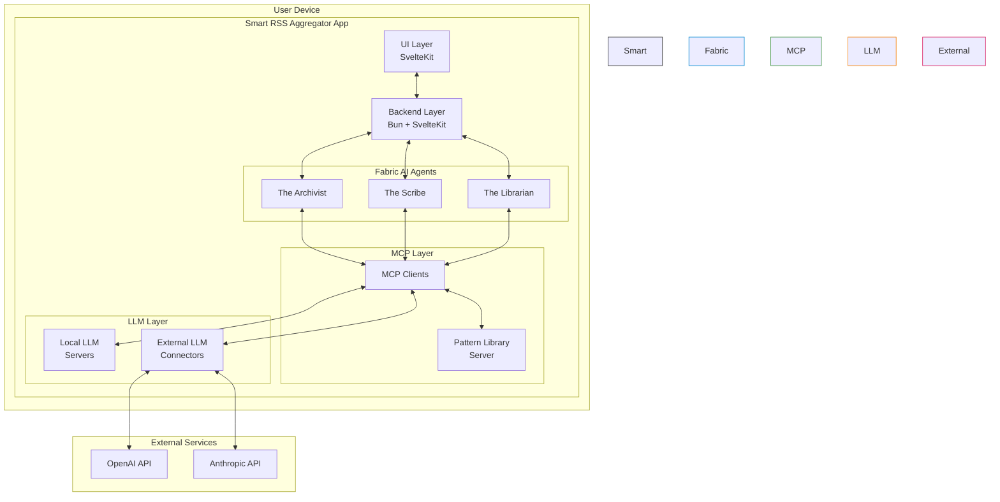
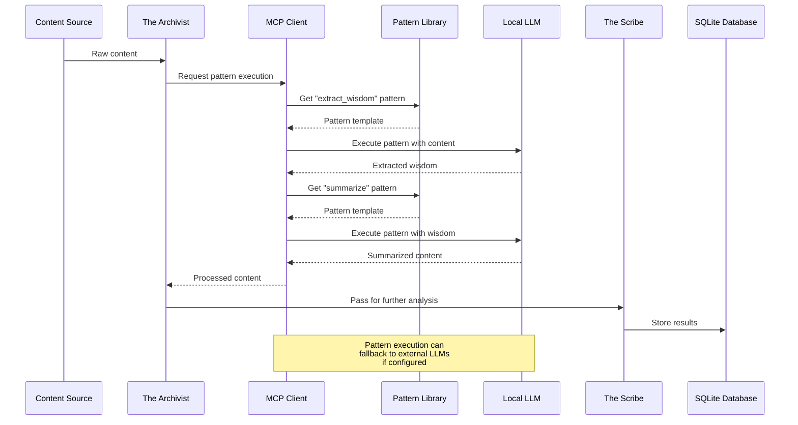
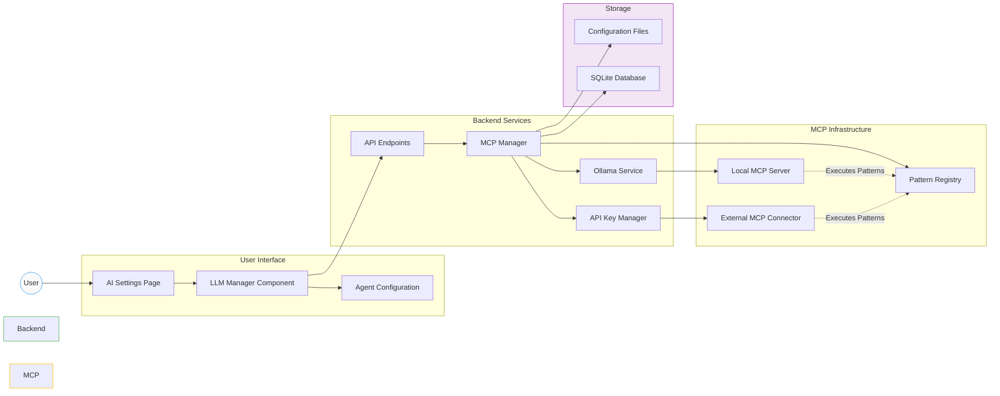

# Integration Report: Model Context Protocol (MCP) with Fabric AI for Smart RSS Aggregator App

## 1. Overview

### Fabric Overview

Fabric, developed by Daniel Miessler, is an open-source framework designed to augment human capabilities using AI (<https://github.com/danielmiessler/fabric>). It provides a modular system for solving specific problems through a crowdsourced library of AI prompts, called "patterns," which can be executed anywhere. Key features include:

- **Pattern Library**: A collection of reusable, Markdown-based prompts (e.g., `summarize`, `extract_wisdom`) stored in `/patterns`, enabling tasks like summarization, analysis, and content extraction.
- **Command-Line Interface (CLI)**: A Go-based client for running patterns with inputs from stdin, URLs, or files, supporting local and external LLMs via vendors like Ollama, OpenAI, and Anthropic.
- **Flexibility**: Supports custom patterns, streaming results, and integration with various AI models.

### MCP Overview

MCP is a standardized protocol for connecting AI models to data sources, using a client-server architecture. It supports secure, flexible connections to local or external data, making it ideal for managing LLM interactions in a consistent manner.

### Objectives

Integrate MCP with Fabric AI to enhance the Smart RSS Aggregator App by:

1. Leveraging Fabric’s pattern library for content processing.
2. Enabling sequences/pipes of LLM requests using dynamic patterns.
3. Developing a UI for installing and configuring LLM connections (local and external).

---

## 2. Research on Fabric Features

### Pattern Library

- **Structure**: Located in `/patterns` (e.g., <https://github.com/danielmiessler/fabric/tree/main/patterns>), each pattern consists of `system.md` (instructions) and optional `user.md` (user input guidance). Examples include `summarize`, `analyze_claims`, and `extract_wisdom`.
- **Usage**: Patterns are executed via the CLI (e.g., `fabric -p summarize < input.txt`) or programmatically, with outputs in Markdown.
- **Customization**: Users can create private patterns in `~/.config/custompatterns/`, keeping them separate from the public library.

### Sequencing/Piping LLM Requests

- **Current Capability**: Fabric supports basic piping via CLI (e.g., `pbpaste | fabric -p analyze_claims`), but lacks native multi-pattern sequencing. However, the concept of "stitches" (chained patterns) is proposed—e.g., filtering data with a local model before sending it to a cloud model.
- **Potential**: Dynamic patterns could be chained programmatically or via CLI flags (e.g., `-p pattern1 | pattern2`), enabling workflows like extracting key points then summarizing them.

### LLM Connections

- **Supported Vendors**: Fabric integrates with local LLMs (e.g., Ollama) and external APIs (e.g., OpenAI, Anthropic) via `/vendors` (<https://github.com/danielmiessler/fabric/tree/main/vendors>).
- **Configuration**: Managed through CLI flags (e.g., `--model ollama/llama2`) or a config file in `~/.config/fabric/`. Local LLMs require a running instance (e.g., Ollama server), while external ones need API keys.
- **Installation**: Users must manually install Fabric and LLMs (e.g., via `go install` or downloading binaries), with no built-in UI.

---

## 3. MCP Integration with Fabric AI

### Architecture Proposal

Integrate MCP as a bridge between Fabric AI’s agents (Archivist, Scribe, Librarian) and LLMs, leveraging Fabric’s features within the app’s local-first, privacy-focused design.

#### Components

1. **MCP Servers**:

   - **Local LLMs**: Each local LLM (e.g., via Ollama) runs as an MCP server on the user’s device, exposing endpoints for Fabric patterns.
   - **External LLMs**: Connect to vendor APIs (e.g., OpenAI) as MCP servers, with encrypted communication.
   - **Pattern Library**: An MCP server hosts the Fabric pattern library, serving patterns as callable endpoints.

2. **MCP Clients**:

   - Fabric AI agents (e.g., Scribe) act as MCP clients, requesting data or LLM outputs via standardized MCP calls.
   - The app’s backend (Bun + SvelteKit) mediates these requests, ensuring seamless integration.

3. **UI Layer**:
   - Built with SvelteKit, extending the existing interface to manage MCP connections and LLM configurations.

#### MCP-Fabric Integration Architecture



---

### Feature-Specific Integration

#### 1. Leveraging the Pattern Library

- **Implementation**:
  - Deploy Fabric’s pattern library as an MCP server within the app, accessible at a local endpoint (e.g., `http://localhost:8080/patterns`).
  - Agents call patterns via MCP (e.g., `mcp://patterns/summarize`), passing content from the SQLite database or web scraper.
- **Example Workflow**:
  - The Scribe uses `summarize` to process an article, requesting it through MCP: `mcp://patterns/summarize?input=<article>`.
  - The MCP server executes the pattern using the configured LLM and returns Markdown output.
- **Benefits**:
  - Centralized pattern management, with updates synced from Fabric’s GitHub repo.
  - Consistent interface for all agents, aligning with functional programming principles.

#### 2. Sequencing/Piping LLM Requests with Dynamic Patterns

- **Implementation**:
  - Extend Fabric’s CLI concept of "stitches" into an MCP-based pipeline system.
  - Define sequences in the app’s backend (e.g., `sequence: [extract_wisdom, summarize]`), executed as chained MCP calls.
  - Use dynamic patterns by passing outputs as inputs (e.g., `mcp://patterns/extract_wisdom | mcp://patterns/summarize`).
- **Example Workflow**:
  - The Archivist collects content, then pipes it through:
    1. `extract_wisdom` (via MCP) to get key insights.
    2. `summarize` (via MCP) to condense the insights.
  - Results are stored in SQLite for The Librarian to recommend.
- **Benefits**:
  - Enables complex workflows (e.g., extract → analyze → recommend) without altering agent logic.
  - Supports local LLMs for privacy, with fallback to external ones if configured.

#### Pattern Sequencing Workflow



#### 3. UI for Installing and Configuring LLM Connections

- **Implementation**:
  - **Installation**:
    - Add a SvelteKit UI component (e.g., `LLMManager.svelte`) under `/src/lib/components/ai/`.
    - Fetch available LLMs from Fabric’s supported vendors (e.g., Ollama, OpenAI) and display them in a list.
    - For local LLMs, trigger downloads (e.g., via Ollama’s API) and set up MCP servers automatically.
    - For external LLMs, prompt for API keys and configure MCP connections.
  - **Configuration**:
    - Provide a form to adjust LLM settings (e.g., model name, temperature) and assign them to agents or patterns.
    - Store settings in `~/.config/fabric/` or SQLite, synced with MCP server states.
  - **Backend Support**:
    - Use Bun to handle LLM installation (e.g., shell commands for Ollama) and MCP server initialization.
    - Expose an API endpoint (e.g., `/api/llm/configure`) to update MCP connections dynamically.
- **Example UI Flow**:
  - User navigates to “AI Settings,” clicks “Add LLM,” selects “Ollama/llama2,” and downloads it.
  - Configures it for The Scribe with a 0.7 temperature, saving the MCP connection as `mcp://localhost:11434/llama2`.
- **Benefits**:
  - Simplifies LLM management for non-technical users, enhancing accessibility.
  - Maintains privacy by defaulting to local LLMs, with optional external integration.

#### Component Interaction Flow



#### 4. Additional Features (Etc.)

- **Pattern Creation UI**:
  - Add a UI to craft custom patterns, saving them locally and exposing them via MCP.
- **Monitoring**:
  - Display LLM status (e.g., running, resource usage) via MCP server telemetry in the UI.
- **Fallbacks**:
  - Configure MCP to switch between local and external LLMs if one fails, enhancing reliability.

---

## 4. Technical Implementation

### Backend (Bun + SvelteKit)

```typescript
// src/lib/server/ai/mcp.ts
import { spawn } from 'child_process';

class MCPManager {
  async startLLMServer(vendor: string, model: string) {
    if (vendor === 'ollama') {
      // Start Ollama server as MCP endpoint
      spawn('ollama', ['serve'], { detached: true });
      return `mcp://localhost:11434/${model}`;
    }
    // Add external vendors (e.g., OpenAI) with API key
  }

  async executePattern(pattern: string, input: string, llmUrl: string) {
    const response = await fetch(`${llmUrl}/${pattern}`, {
      method: 'POST',
      body: JSON.stringify({ input })
    });
    return response.json();
  }
}

export const mcp = new MCPManager();
```

### UI (SvelteKit)

```svelte
<!-- src/lib/components/ai/LLMManager.svelte -->
<script>
  import { mcp } from '$lib/server/ai/mcp';

  let llms = ['ollama/llama2', 'openai/gpt-4o'];
  let selectedLLM = '';
  let config = { temperature: 0.7 };

  async function installLLM() {
    const url = await mcp.startLLMServer(selectedLLM.split('/')[0], selectedLLM.split('/')[1]);
    console.log(`LLM running at ${url}`);
  }
</script>

<select bind:value={selectedLLM}>
  {#each llms as llm}
    <option value={llm}>{llm}</option>
  {/each}
</select>
<button on:click={installLLM}>Install & Configure</button>
```

### Pattern Sequencing

```typescript
// src/lib/server/ai/sequencer.ts
async function runSequence(input: string, patterns: string[], llmUrl: string) {
  let result = input;
  for (const pattern of patterns) {
    result = await mcp.executePattern(pattern, result, llmUrl);
  }
  return result;
}

// Usage: Archivist -> Scribe
const output = await runSequence(
  article,
  ['extract_wisdom', 'summarize'],
  'mcp://localhost:11434/llama2'
);
```

---

## 5. Benefits and Challenges

### Benefits

- **Pattern Library**: Direct access to Fabric’s powerful prompts, enhancing agent capabilities.
- **Sequencing**: Flexible workflows improve content processing efficiency.
- **UI**: User-friendly LLM management aligns with the app’s design goals.
- **Scalability**: MCP prepares the app for future external integrations.

### Challenges

- **Performance**: MCP servers may add latency; optimize with local caching.
- **Complexity**: Requires careful integration to avoid overwhelming the lightweight app.
- **Resource Use**: Multiple LLMs need resource monitoring, adjustable via UI.

---

## 6. Conclusion

Integrating MCP with Fabric AI creates a robust, user-centric system for the Smart RSS Aggregator App. By leveraging Fabric’s pattern library, enabling dynamic LLM request sequences, and providing a UI for LLM management, this approach enhances functionality while preserving privacy and modularity. Start with a minimal MCP setup (e.g., local LLMs and key patterns), then expand as needed, ensuring a balance between power and simplicity.
