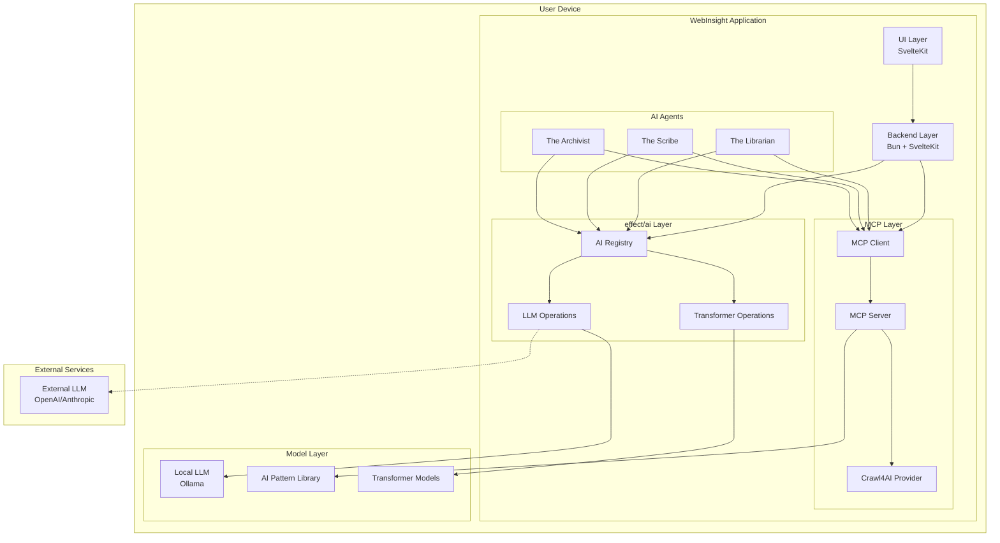
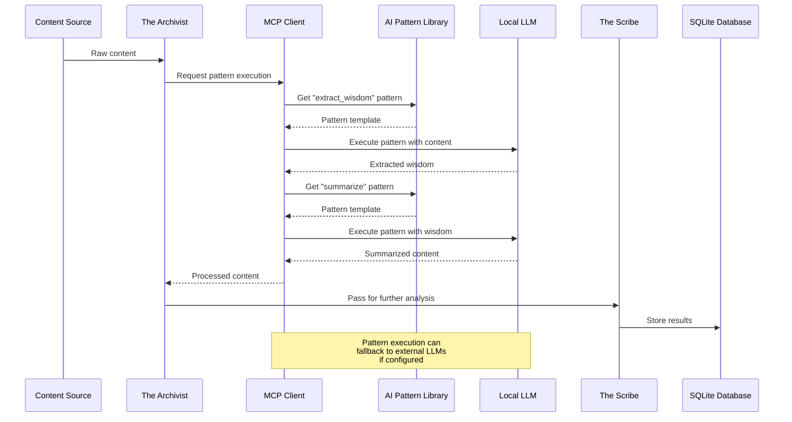
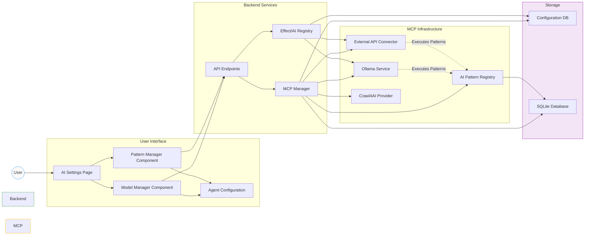

# Integration Report: Model Context Protocol (MCP) with AI Pattern Library for WebInsight

## 1. Overview

### AI Pattern Library Overview

The AI Pattern Library is inspired by Fabric (developed by Daniel Miessler), an open-source framework designed to augment human capabilities using AI (<https://github.com/danielmiessler/fabric>). Our implementation focuses specifically on the pattern library concept, providing a modular system for solving specific problems through a collection of AI prompts called "patterns." Key features include:

- **Pattern Library**: A collection of reusable, Markdown-based prompts (e.g., `summarize`, `extract_wisdom`) stored in a structured format, enabling tasks like summarization, analysis, and content extraction.
- **Effect-Based Integration**: Instead of using a CLI, we implement pattern execution through Effect TS and @effect/ai, providing type safety and robust error handling.
- **Flexibility**: Supports custom patterns, streaming results, and integration with various AI models through a unified interface.

### MCP Overview

MCP is a standardized protocol for connecting AI models to data sources, using a client-server architecture. It supports secure, flexible connections to local or external data, making it ideal for managing LLM interactions in a consistent manner.

### Objectives

Integrate MCP with the AI Pattern Library to enhance WebInsight by:

1. Leveraging a structured pattern library for content processing.
2. Enabling sequences/pipes of LLM requests using Effect TS and @effect/ai.
3. Developing a UI for managing patterns and configuring LLM connections (local and external).

---

## 2. Research on AI Pattern Library Features

### Pattern Structure

- **Design**: Inspired by Fabric's pattern structure (<https://github.com/danielmiessler/fabric/tree/main/patterns>), each pattern consists of a system prompt (instructions) and optional user guidance. Examples include `summarize`, `analyze_claims`, and `extract_wisdom`.
- **Usage**: Patterns are executed via Effect TS and @effect/ai, with outputs in Markdown or other structured formats.
- **Customization**: Users can create custom patterns through the UI or configuration files, which are stored in the application's database.

### Sequencing/Piping LLM Requests with @effect/ai

- **Implementation Approach**: Instead of using Fabric's CLI for piping, we'll implement sequence processing with @effect/ai and Effect's functional composition.
- **Effect-Based Sequencing**: Use Effect's pipe operator to chain transformer operations and LLM requests in a type-safe, declarative manner.
- **Benefits**: This approach provides robust error handling, cancellation support, and seamless integration with WebInsight's Effect-based architecture.

```typescript
// Example: Chaining pattern execution with Effect
import { Effect, pipe } from 'effect';
import { AI } from '@effect/ai';
import { PatternLibrary } from '$lib/services/ai/patterns';

// Function to run a sequence of patterns
const runPatternSequence = (
  input: string,
  patterns: string[]
) => Effect.gen(function*(_) {
  // Get the AI registry
  const registry = yield* AI.Registry;
  const llmModel = yield* registry.get("text-generation");
  
  // Process through each pattern in sequence
  let result = input;
  for (const patternName of patterns) {
    const pattern = yield* PatternLibrary.getPattern(patternName);
    result = yield* llmModel.complete(pattern.system, result);
  }
  
  return result;
});
```

### LLM Connections with @effect/ai

- **Model Management**: Use @effect/ai's TransformerModel and LLMModel for standardized access to transformer models and LLMs.
- **Provider Support**: Connect to local models via Ollama and external APIs (OpenAI, Anthropic) through @effect/ai's provider system.
- **Configuration**: Manage models through a type-safe registry with Effect Context for dependency injection.
- **UI Integration**: Implement a user-friendly interface for model selection, configuration, and monitoring.

```typescript
// Example: Setting up LLM models with @effect/ai
import { Effect } from 'effect';
import { AI } from '@effect/ai';
import { LLMModel } from '@effect/ai/LLMModel';

// Define LLM model configurations
const textGenerationModel = LLMModel.make({
  modelId: "llama2",
  provider: "ollama" as const,
  parameters: {
    temperature: 0.7,
    maxTokens: 1024
  }
});

// Register models with the AI registry
const registerModels = Effect.gen(function*(_) {
  const registry = yield* AI.Registry;
  yield* registry.register("text-generation", textGenerationModel);
});

// Run the effect to register models
Effect.runPromise(registerModels);
```

---

## 3. MCP Integration with AI Pattern Library and @effect/ai

### Architecture Proposal

Integrate MCP as a bridge between WebInsight's AI agents (Archivist, Scribe, Librarian) and LLMs, leveraging the AI Pattern Library while using @effect/ai for LLM connections and transformer operations within the app's local-first, privacy-focused design.

#### Components

1. **MCP Servers**:

   - **Pattern Library**: An MCP server hosts the AI Pattern Library, serving patterns as callable endpoints.
   - **Crawl4AI MCP Provider**: Provides web content extraction capabilities through standardized MCP interface.

2. **@effect/ai Integration**:

   - **AI Registry**: Centralized registry for managing transformer models and LLMs with type-safe access.
   - **Model Management**: Unified interface for local models (via Ollama) and external APIs (OpenAI, Anthropic).
   - **Effect-Based Operations**: Functional programming approach for transformer operations and LLM interactions.

3. **MCP Clients**:

   - WebInsight's AI agents (e.g., Scribe) act as MCP clients for pattern library access.
   - The agents use @effect/ai for direct LLM interactions and transformer operations.
   - The app's backend (Bun + SvelteKit) mediates these requests, ensuring seamless integration.

4. **UI Layer**:
   - Built with SvelteKit, extending the existing interface to manage AI models and pattern configurations.

#### MCP and @effect/ai Integration Architecture



---

### Feature-Specific Integration

#### 1. Leveraging the AI Pattern Library

- **Implementation**:
  - Deploy the AI Pattern Library as an MCP server within the app, accessible at a local endpoint (e.g., `http://localhost:8080/patterns`).
  - Implement a pattern discovery API (e.g., `GET /patterns`) to list available patterns and their metadata.
  - Create a pattern execution API (e.g., `POST /patterns/{pattern_name}`) to run patterns with inputs.
  - Agents call patterns via MCP (e.g., `mcp://patterns/summarize`), passing content from the database or web scraper.
- **Example Workflow**:
  - The Scribe uses `summarize` to process an article, requesting it through MCP: `mcp://patterns/summarize?input=<article>`.
  - The MCP server executes the pattern using the configured LLM and returns Markdown output.
- **Benefits**:
  - Centralized pattern management, with updates synced from the AI Pattern Library repository.
  - Consistent interface for all agents, aligning with functional programming principles.

#### 2. Sequencing/Piping LLM Requests with @effect/ai

- **Implementation**:
  - Implement pattern sequences using Effect TS and @effect/ai (e.g., `PatternSequence.execute(['extract_wisdom', 'summarize'], input)`).
  - Define sequences in the app's backend as Effect pipelines, executed as chained operations with proper error handling.
  - Use the Effect pipe operator to compose pattern operations (e.g., `extractWisdom > summarize > categorize`).
- **Example Workflow**:
  - The Archivist collects content, then pipes it through:
    1. `extract_wisdom` (via MCP) to get key insights.
    2. `summarize` (via MCP) to condense the insights.
  - Results are stored in SQLite for The Librarian to recommend.
- **Benefits**:
  - Enables complex workflows (e.g., extract → analyze → recommend) without altering agent logic.
  - Supports local LLMs for privacy, with fallback to external ones if configured.

#### Pattern Sequencing Workflow



#### 3. UI for Managing Patterns and Configuring LLM Connections

- **Implementation**:
  - **Pattern Management**:
    - Create a UI for browsing, creating, and customizing patterns in the AI Pattern Library.
    - Implement pattern categories and tags for easy discovery and organization.
    - Add a pattern testing interface to try patterns with sample inputs before using them in production.
  - **Model Management**:
    - Add a SvelteKit UI component (e.g., `ModelManager.svelte`) under `/src/lib/components/ai/`.
    - Implement configuration for local and external LLMs using @effect/ai's model registry system.
    - Create a user-friendly interface for adjusting model parameters (temperature, max tokens, etc.).
    - For local LLMs, trigger downloads (e.g., via Ollama’s API) and set up MCP servers automatically.
    - For external LLMs, prompt for API keys and configure MCP connections.
  - **Configuration**:
    - Provide a form to adjust LLM settings (e.g., model name, temperature) and assign them to agents or patterns.
    - Store settings in `~/.config/fabric/` or SQLite, synced with MCP server states.
  - **Backend Support**:
    - Use Bun to handle LLM installation (e.g., shell commands for Ollama) and MCP server initialization.
    - Expose an API endpoint (e.g., `/api/llm/configure`) to update MCP connections dynamically.
- **Example UI Flow**:
  - User navigates to “AI Settings,” clicks “Add LLM,” selects “Ollama/llama2,” and downloads it.
  - Configures it for The Scribe with a 0.7 temperature, saving the MCP connection as `mcp://localhost:11434/llama2`.
- **Benefits**:
  - Simplifies LLM management for non-technical users, enhancing accessibility.
  - Maintains privacy by defaulting to local LLMs, with optional external integration.

#### Component Interaction Flow



#### 4. Additional Features

- **Pattern Creation and Management**:
  - Add a UI to create, edit, and categorize patterns in the AI Pattern Library.
  - Implement pattern versioning and sharing capabilities.
  - Create a pattern testing playground for rapid iteration.
- **Performance Monitoring**:
  - Display model performance metrics (latency, token usage, costs) in the UI.
  - Implement logging and tracing for AI operations using Effect TS capabilities.
- **Fallback and Resilience**:
  - Configure the AI Registry to automatically switch between models if one fails.
  - Implement retry policies and circuit breakers using Effect's retry and schedule modules.

---

## 4. Technical Implementation

### MCP and @effect/ai Integration

```typescript
// src/lib/server/ai/mcp-manager.ts
import { Effect } from 'effect';
import { AI } from '@effect/ai';
import { LLMModel } from '@effect/ai/LLMModel';
import { PatternLibrary } from '$lib/services/ai/patterns';
import type { ServiceError } from '$lib/services/error';

export class MCPManager {
  // Register models with the AI registry
  static registerModels = Effect.gen(function*(_) {
    const registry = yield* AI.Registry;
    
    // Register local LLM via Ollama
    const localLLM = LLMModel.make({
      modelId: "llama2",
      provider: "ollama" as const,
      parameters: {
        temperature: 0.7,
        maxTokens: 1024
      }
    });
    yield* registry.register("local-llm", localLLM);
    
    // Register external LLM (if configured)
    const apiKey = yield* Effect.tryPromise(() => 
      import.meta.env.VITE_OPENAI_API_KEY || ''
    );
    
    if (apiKey) {
      const externalLLM = LLMModel.make({
        modelId: "gpt-4o",
        provider: "openai" as const,
        parameters: {
          temperature: 0.7,
          maxTokens: 2048
        }
      });
      yield* registry.register("external-llm", externalLLM);
    }
    
    return registry;
  });
  
  // Execute a pattern using the specified model
  static executePattern = (
    patternName: string, 
    input: string,
    modelKey: string = "local-llm"
  ): Effect.Effect<string, ServiceError> => {
    return Effect.gen(function*(_) {
      // Get the AI registry
      const registry = yield* AI.Registry;
      const model = yield* registry.get(modelKey);
      
      // Get the pattern from the library
      const pattern = yield* PatternLibrary.getPattern(patternName);
      
      // Execute the pattern with the model
      const result = yield* model.complete(pattern.system, input);
      
      return result;
    });
  };
}
```

### Pattern Library Service

```typescript
// src/lib/services/ai/patterns.ts
import { Effect } from 'effect';
import type { ServiceError } from '$lib/services/error';

export interface Pattern {
  id: string;
  name: string;
  description: string;
  system: string;
  user?: string;
}

export class PatternLibrary {
  // Get a pattern by name
  static getPattern = (patternName: string): Effect.Effect<Pattern, ServiceError> => {
    return Effect.gen(function*(_) {
      // Fetch pattern from MCP server or local storage
      const response = yield* Effect.tryPromise(
        () => fetch(`/api/mcp/patterns/${patternName}`),
        (error) => ({ type: 'ServiceError', message: `Failed to fetch pattern: ${error}` })
      );
      
      if (!response.ok) {
        return yield* Effect.fail({ 
          type: 'ServiceError', 
          message: `Pattern not found: ${patternName}` 
        });
      }
      
      const pattern = yield* Effect.tryPromise(
        () => response.json(),
        (error) => ({ type: 'ServiceError', message: `Failed to parse pattern: ${error}` })
      );
      
      return pattern as Pattern;
    });
  };
  
  // List all available patterns
  static listPatterns = Effect.gen(function*(_) {
    const response = yield* Effect.tryPromise(
      () => fetch('/api/mcp/patterns'),
      (error) => ({ type: 'ServiceError', message: `Failed to list patterns: ${error}` })
    );
    
    if (!response.ok) {
      return yield* Effect.fail({ 
        type: 'ServiceError', 
        message: 'Failed to list patterns' 
      });
    }
    
    const patterns = yield* Effect.tryPromise(
      () => response.json(),
      (error) => ({ type: 'ServiceError', message: `Failed to parse patterns: ${error}` })
    );
    
    return patterns as Pattern[];
  });
}
```

### UI Components (SvelteKit)

```svelte
<!-- src/lib/components/ai/ModelManager.svelte -->
<script lang="ts">
  import { onMount } from 'svelte';
  import { Effect } from 'effect';
  import { MCPManager } from '$lib/server/ai/mcp-manager';
  import type { LLMConfig } from '$lib/types/ai';
  
  let models = [
    { id: 'llama2', provider: 'ollama', name: 'Llama 2' },
    { id: 'gpt-4o', provider: 'openai', name: 'GPT-4o' },
    { id: 'claude-3-opus', provider: 'anthropic', name: 'Claude 3 Opus' }
  ];
  
  let selectedModel = models[0];
  let config: LLMConfig = { 
    temperature: 0.7,
    maxTokens: 1024,
    topP: 1
  };
  let status = 'Not configured';
  
  onMount(async () => {
    // Check if models are already registered
    const result = await Effect.runPromise(
      Effect.either(MCPManager.registerModels)
    );
    
    if (result._tag === 'Right') {
      status = 'Models configured';
    }
  });
  
  async function configureModel() {
    status = 'Configuring...';
    
    const result = await Effect.runPromise(
      Effect.either(MCPManager.registerModels)
    );
    
    if (result._tag === 'Right') {
      status = `${selectedModel.name} configured successfully`;
    } else {
      status = `Error: ${result.left.message}`;
    }
  }
</script>

<div class="model-manager">
  <h3>AI Model Configuration</h3>
  
  <div class="form-group">
    <label for="model">Select Model</label>
    <select id="model" bind:value={selectedModel}>
      {#each models as model}
        <option value={model}>{model.name} ({model.provider})</option>
      {/each}
    </select>
  </div>
  
  <div class="form-group">
    <label for="temperature">Temperature</label>
    <input type="range" id="temperature" min="0" max="1" step="0.1" bind:value={config.temperature}>
    <span>{config.temperature}</span>
  </div>
  
  <div class="form-group">
    <label for="max-tokens">Max Tokens</label>
    <input type="number" id="max-tokens" min="256" max="4096" step="256" bind:value={config.maxTokens}>
  </div>
  
  <button on:click={configureModel}>Configure Model</button>
  
  <div class="status">
    Status: {status}
  </div>
</div>

<style>
  .model-manager {
    padding: 1rem;
    border: 1px solid #ccc;
    border-radius: 0.5rem;
  }
  
  .form-group {
    margin-bottom: 1rem;
  }
  
  .status {
    margin-top: 1rem;
    font-style: italic;
  }
</style>
```

### Pattern Execution Component

```svelte
<!-- src/lib/components/ai/PatternExecutor.svelte -->
<script lang="ts">
  import { onMount } from 'svelte';
  import { Effect } from 'effect';
  import { PatternLibrary } from '$lib/services/ai/patterns';
  import { MCPManager } from '$lib/server/ai/mcp-manager';
  
  let patterns = [];
  let selectedPatterns = [];
  let input = '';
  let output = '';
  let loading = false;
  
  onMount(async () => {
    const result = await Effect.runPromise(
      Effect.either(PatternLibrary.listPatterns)
    );
    
    if (result._tag === 'Right') {
      patterns = result.right;
    }
  });
  
  async function executePatterns() {
    if (!input || selectedPatterns.length === 0) return;
    
    loading = true;
    output = '';
    
    let currentInput = input;
    
    for (const pattern of selectedPatterns) {
      const result = await Effect.runPromise(
        Effect.either(MCPManager.executePattern(pattern.id, currentInput))
      );
      
      if (result._tag === 'Right') {
        currentInput = result.right;
        output = currentInput;
      } else {
        output = `Error: ${result.left.message}`;
        break;
      }
    }
    
    loading = false;
  }
</script>

<div class="pattern-executor">
  <h3>Pattern Execution</h3>
  
  <div class="patterns-selection">
    <label>Select Patterns to Execute (in sequence)</label>
    <div class="patterns-list">
      {#each patterns as pattern}
        <label>
          <input type="checkbox" bind:group={selectedPatterns} value={pattern}>
          {pattern.name} - {pattern.description}
        </label>
      {/each}
    </div>
  </div>
  
  <div class="input-output">
    <div class="input">
      <label for="input">Input</label>
      <textarea id="input" bind:value={input} rows="10" placeholder="Enter text to process"></textarea>
    </div>
    
    <button on:click={executePatterns} disabled={loading || !input || selectedPatterns.length === 0}>
      {loading ? 'Processing...' : 'Execute Patterns'}
    </button>
    
    <div class="output">
      <label for="output">Output</label>
      <div class="output-content" id="output">
        {#if loading}
          <div class="loading">Processing...</div>
        {:else if output}
          <div class="result">{@html output}</div>
        {:else}
          <div class="empty">Output will appear here</div>
        {/if}
      </div>
    </div>
  </div>
</div>

<style>
  .pattern-executor {
    display: flex;
    flex-direction: column;
    gap: 1rem;
  }
  
  .patterns-list {
    display: flex;
    flex-direction: column;
    gap: 0.5rem;
    max-height: 200px;
    overflow-y: auto;
    border: 1px solid #ddd;
    padding: 0.5rem;
    border-radius: 0.25rem;
  }
  
  .input-output {
    display: grid;
    grid-template-columns: 1fr;
    gap: 1rem;
  }
  
  textarea {
    width: 100%;
    font-family: monospace;
  }
  
  .output-content {
    min-height: 200px;
    border: 1px solid #ddd;
    padding: 0.5rem;
    border-radius: 0.25rem;
    font-family: monospace;
    white-space: pre-wrap;
  }
  
  .loading {
    font-style: italic;
    color: #666;
  }
  
  .empty {
    color: #999;
    font-style: italic;
  }
</style>
```

---

## 5. Benefits and Challenges

### Benefits

- **Pattern Library**: Direct access to Fabric's powerful prompts, enhancing agent capabilities while maintaining a clean separation of concerns.
- **Effect-Based Architecture**: Using @effect/ai provides robust error handling, cancellation support, and seamless integration with WebInsight's functional programming approach.
- **Type Safety**: The Effect TS ecosystem ensures type safety throughout the AI operations, reducing runtime errors and improving developer experience.
- **Unified Model Management**: Centralized AI registry simplifies model configuration and switching between local and external providers.
- **Scalability**: The MCP + @effect/ai combination prepares the app for future integrations while maintaining consistent interfaces.

### Challenges

- **Performance**: Effect-based operations may add overhead; optimize with strategic memoization and caching.
- **Learning Curve**: Developers need to understand both MCP concepts and Effect TS patterns to effectively work with the integration.
- **Resource Management**: Local LLMs require careful resource monitoring and management, which should be exposed through the UI.
- **Testing Complexity**: Testing Effect-based AI operations requires specialized approaches to handle effects and dependencies.

---

## 6. Conclusion

Integrating MCP with the AI Pattern Library and @effect/ai creates a robust, type-safe, and user-centric system for WebInsight. This approach combines the best of both worlds:

1. **AI Pattern Library**: Provides a rich collection of reusable, specialized AI prompts that enhance content processing capabilities while maintaining a clean separation of concerns.

2. **@effect/ai Integration**: Delivers type-safe, functional programming patterns for AI operations with robust error handling and cancellation support.

3. **MCP Architecture**: Ensures standardized communication between components, enabling modular design and future extensibility.

This integration aligns perfectly with WebInsight's local-first, privacy-focused design principles while leveraging Effect TS for managing side effects and ensuring type safety throughout the application. The implementation prioritizes:

- **Developer Experience**: Type-safe interfaces and functional composition patterns.
- **User Privacy**: Local-first architecture with optional external LLM connections.
- **Modularity**: Clean separation between pattern execution, model management, and UI components.
- **Extensibility**: Easy addition of new patterns and models through the standardized interfaces.

The recommended implementation approach is incremental: start with core pattern library integration and local LLM support via @effect/ai, then expand to include additional features like pattern sequencing and external LLM connections as needed. This ensures a balance between functionality and simplicity while maintaining the project's core principles.
