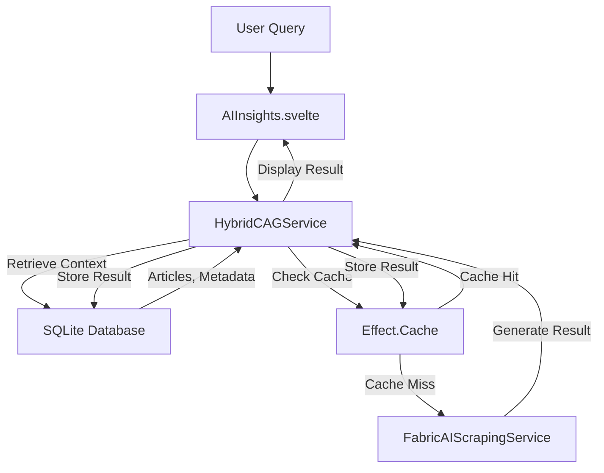

# Hybrid CAG/RAG Strategy with Effect Cache

## Overview

WebInsight implements a hybrid Cache-Augmented Generation (CAG) and Retrieval-Augmented Generation (RAG) strategy leveraging the `Effect` library's caching capabilities. This approach optimizes AI-driven insights while maintaining alignment with WebInsight's local-first, privacy-focused design principles. The strategy enhances performance, accuracy, and reliability of AI operations without compromising user privacy.

## Core Concepts

### Cache-Augmented Generation (CAG)

- **Definition**: Caches AI-generated outputs (summaries, recommendations, metadata) to reduce redundant computations
- **Benefits**: Improves response times, minimizes LLM usage, enhances reliability
- **Implementation**: Uses `Effect.Cache` with type-safe key/value storage and configurable TTL

### Retrieval-Augmented Generation (RAG)

- **Definition**: Retrieves relevant content from the local database to enrich AI generation
- **Benefits**: Improves output quality by providing context, enhances relevance of AI-generated content
- **Implementation**: Uses metadata-based retrieval with future plans for embedding-based similarity search

### Hybrid Approach

- **Definition**: Integrates CAG and RAG to balance efficiency and accuracy
- **Benefits**: Combines performance benefits of caching with contextual improvements from retrieval
- **Implementation**: Unified workflow that checks cache first, then retrieves context if needed, and finally generates new content

## Integration with Architecture

The hybrid CAG/RAG strategy integrates with WebInsight's existing components:



### Data Layer Enhancements

#### Database Schema Extensions

The SQLite database is enhanced with additional tables and fields:

- **`articles` Table**: Enhanced with metadata fields (tags, entities) for efficient retrieval
- **`cached_results` Table**: New table storing AI outputs with fields:
  - `articleId`: Reference to the source article
  - `queryType`: Type of AI operation (e.g., 'summary', 'recommendation')
  - `result`: The cached AI output
  - `timestamp`: When the result was generated
  - `ttl`: Time-to-live in milliseconds

#### Privacy Considerations

- All data remains local with optional SQLCipher encryption for private profiles
- No external dependencies for caching or retrieval operations
- User-configurable TTL settings for cached results

## Implementation Details

### 1. HybridCAGService

The core service implementing the hybrid strategy:

```typescript
import * as Effect from 'effect/Effect';
import * as Context from 'effect/Context';
import * as Layer from 'effect/Layer';
import * as Cache from 'effect/Cache';
import { pipe } from 'effect/Function';
import * as Z from 'zod';
import { drizzle } from 'drizzle-orm/sqlite';
import { articles, cachedResults } from './schema';
import { WebScrapingService } from './WebScrapingService';
import { FabricAIScrapingService } from './FabricAIScrapingService';

// Context Tags
const Database = Context.Tag<ReturnType<typeof drizzle>>();
const WebScraping = Context.Tag<WebScrapingService>();
const FabricAI = Context.Tag<FabricAIScrapingService>();

// Cache Key Schema
const CacheKeySchema = Z.object({
  articleId: Z.string(),
  queryType: Z.enum(['summary', 'recommendation', 'metadata']),
});

// Service Interface
interface HybridCAGService {
  getOrGenerate: (
    articleId: string,
    queryType: 'summary' | 'recommendation' | 'metadata',
    context?: string[]
  ) => Effect.Effect<string, Error, Database | WebScraping | FabricAI>;
}

const HybridCAGService = Context.Tag<HybridCAGService>();

const makeHybridCAGService = Effect.gen(function* (_) {
  const db = yield* _(Database);
  const webScraping = yield* _(WebScraping);
  const fabricAI = yield* _(FabricAI);

  const cache = yield* _(
    Cache.make({
      lookup: (key: Z.infer<typeof CacheKeySchema>) =>
        Effect.gen(function* (_) {
          const cached = yield* _(
            Effect.tryPromise(() =>
              db.select().from(cachedResults).where({ articleId: key.articleId, queryType: key.queryType }).get()
            )
          );

          if (cached && isValidCache(cached)) {
            return cached.result;
          }

          const context = yield* _(retrieveContext(key.articleId, key.queryType));
          const result = yield* _(
            generateResult(key.articleId, key.queryType, context)
          );

          yield* _(
            Effect.tryPromise(() =>
              db.insert(cachedResults).values({
                articleId: key.articleId,
                queryType: key.queryType,
                result,
                timestamp: Date.now(),
                ttl: 24 * 60 * 60 * 1000,
              }).run()
            )
          );

          return result;
        }),
      capacity: 1000,
      timeToLive: '1 day',
    })
  );

  const retrieveContext = (articleId: string, queryType: string) =>
    Effect.gen(function* (_) {
      const article = yield* _(
        Effect.tryPromise(() =>
          db.select().from(articles).where({ id: articleId }).get()
        )
      );
      if (!article) return [];

      const similarArticles = yield* _(
        Effect.tryPromise(() =>
          db.select().from(articles).where({ tags: article.tags }).limit(5).all()
        )
      );

      return similarArticles.map(a => a.content);
    });

  const generateResult = (articleId: string, queryType: string, context: string[]) =>
    Effect.gen(function* (_) {
      const article = yield* _(
        Effect.tryPromise(() =>
          db.select().from(articles).where({ id: articleId }).get()
        )
      );
      if (!article) return yield* _(Effect.fail(new Error('Article not found')));

      const prompt = buildPrompt(queryType, article.content, context);
      return yield* _(fabricAI.process(prompt));
    });

  const isValidCache = (cached: any) => {
    const now = Date.now();
    return cached.timestamp + (cached.ttl || 24 * 60 * 60 * 1000) > now;
  };

  const buildPrompt = (queryType: string, content: string, context: string[]) => {
    switch (queryType) {
      case 'summary':
        return `Summarize the following article: ${content}\nContext: ${context.join('\n')}`;
      case 'recommendation':
        return `Recommend articles based on: ${content}\nContext: ${context.join('\n')}`;
      case 'metadata':
        return `Extract metadata from: ${content}\nContext: ${context.join('\n')}`;
      default:
        return '';
    }
  };

  return { 
    getOrGenerate: (articleId, queryType, context = []) =>
      pipe(
        CacheKeySchema.parse({ articleId, queryType }),
        key => cache.get(key),
        Effect.flatMap(result => Effect.succeed(result))
      ) 
  };
});

const HybridCAGServiceLive = Layer.effect(
  HybridCAGService,
  makeHybridCAGService
).pipe(
  Layer.provide(Database.Live),
  Layer.provide(WebScraping.Live),
  Layer.provide(FabricAI.Live)
);
```

### 2. Frontend Integration

SvelteKit components display cached or generated results:

```svelte
<script lang="ts">
  import { onMount } from 'svelte';
  import { Effect } from 'effect';
  import { HybridCAGService } from './HybridCAGService';

  export let articleId: string;
  let result = '';
  let loading = false;

  onMount(async () => {
    loading = true;
    const program = Effect.gen(function* (_) {
      const service = yield* _(HybridCAGService);
      return yield* _(service.getOrGenerate(articleId, 'summary'));
    });

    result = await Effect.runPromise(program.pipe(Effect.provide(HybridCAGServiceLive)));
    loading = false;
  });
</script>

<div class="p-4">
  {#if loading}
    <p>Loading...</p>
  {:else}
    <p>{result}</p>
  {/if}
</div>
```

### 3. Workflow Process

The hybrid CAG/RAG workflow follows these steps:

1. **Query Analysis**: Parse the user query to determine `articleId` and `queryType`
2. **Cache Check (CAG)**: Check `Effect.Cache` for a valid cached result
3. **Retrieval (RAG)**: If no valid cache, query the database for relevant context
4. **Generation**: Generate the output using Fabric AI with retrieved context
5. **Cache Update**: Store the result in `Effect.Cache` and the database

## Alignment with Requirements

### Functional Requirements

- **FR2.1 (AI Processing)**: RAG improves summarization and metadata extraction; CAG reduces LLM load
- **FR2.3 (Recommendations)**: RAG retrieves relevant articles for better recommendations
- **FR4.1–FR5.7 (Privacy)**: Local processing ensures data isolation

### Non-Functional Requirements

- **NFR1 (Performance)**: Caching reduces latency and improves responsiveness
- **NFR2 (Reliability)**: Cached results provide fallback when LLM services are unavailable
- **NFR3 (Privacy)**: No external dependencies for caching or retrieval
- **NFR5 (Modularity)**: Effect's layers ensure scalability and maintainability

## Testing Strategy

- **Unit Tests**: Test `HybridCAGService` for cache hits/misses and retrieval accuracy
- **Integration Tests**: Verify interaction between `Effect.Cache`, SQLite, and Fabric AI
- **End-to-End Tests**: Simulate user queries to ensure correct results from cache or generation

## Roadmap Integration

### Phase 2 (Current)

- Implement metadata-based retrieval and basic caching
- Integrate with existing AI processing pipelines
- Add user preferences for cache TTL

### Phase 3 (AI Agents)

- Enhance with embedding-based search for more accurate context retrieval
- Implement advanced cache invalidation strategies
- Add visualization for cache performance metrics

## Conclusion

The hybrid CAG/RAG strategy with `Effect.Cache` enhances WebInsight's performance, accuracy, and privacy by combining efficient caching with context-aware generation. It integrates seamlessly with the existing architecture, supports the project's roadmap, and ensures a modular, scalable implementation aligned with the functional programming principles of the project.
