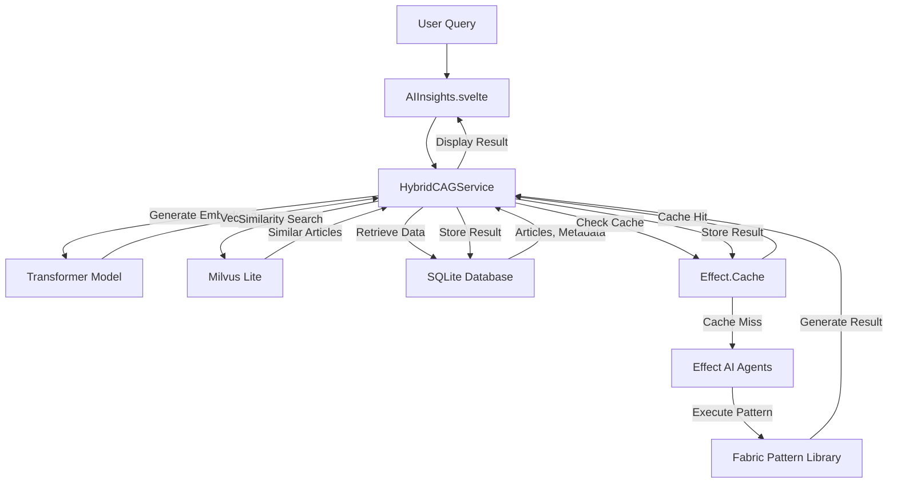

# Hybrid CAG/RAG Strategy with Transformers, Milvus Lite, and Effect Cache

## Overview

WebInsight implements a hybrid Cache-Augmented Generation (CAG) and Retrieval-Augmented Generation (RAG) strategy leveraging transformer models, Milvus Lite for vector storage, and the `Effect` library's caching capabilities through `@effect/ai`. This approach optimizes AI-driven insights while maintaining alignment with WebInsight's local-first, privacy-focused design principles. The strategy enhances performance, accuracy, and reliability of AI operations without compromising user privacy.

## Core Concepts

### Cache-Augmented Generation (CAG)

- **Definition**: Caches AI-generated outputs (summaries, recommendations, metadata) to reduce redundant computations
- **Benefits**: Improves response times, minimizes LLM usage, enhances reliability
- **Implementation**: Uses `Effect.Cache` with type-safe key/value storage and configurable TTL

### Retrieval-Augmented Generation (RAG)

- **Definition**: Retrieves relevant content from the local database to enrich AI generation
- **Benefits**: Improves output quality by providing context, enhances relevance of AI-generated content
- **Implementation**: Uses transformer-generated embeddings stored in Milvus Lite for semantic similarity search

### Hybrid Approach

- **Definition**: Integrates CAG and RAG to balance efficiency and accuracy
- **Benefits**: Combines performance benefits of caching with contextual improvements from retrieval
- **Implementation**: Unified workflow that checks cache first, then retrieves context if needed, and finally generates new content

## Integration with Architecture

The hybrid CAG/RAG strategy integrates with WebInsight's existing components enhanced with transformers and Milvus Lite:



### Data Layer Enhancements

#### Database Schema Extensions

The data layer is enhanced with both SQLite and Milvus Lite databases:

- **SQLite Database**:

  - **`articles` Table**: Enhanced with metadata fields (tags, entities) and an `embeddingId` field referencing vectors in Milvus Lite
  - **`cached_results` Table**: New table storing AI outputs with fields:
    - `articleId`: Reference to the source article
    - `queryType`: Type of AI operation (e.g., 'summary', 'recommendation')
    - `result`: The cached AI output
    - `timestamp`: When the result was generated
    - `ttl`: Time-to-live in milliseconds

- **Milvus Lite Database**:
  - **`article_embeddings` Collection**: Stores transformer-generated embeddings with fields:
    - `id`: Unique identifier matching the `embeddingId` in SQLite
    - `vector`: The embedding vector (typically 384-dimensional for all-MiniLM-L6-v2)
    - `article_id`: Reference to the source article
    - `timestamp`: When the embedding was generated

#### Privacy Considerations

- All data remains local with optional SQLCipher encryption for private profiles
- Transformer models run locally via Ollama for privacy-preserving embedding generation
- Milvus Lite operates entirely locally without external dependencies
- No external dependencies for caching or retrieval operations
- User-configurable TTL settings for cached results and embeddings

## Implementation Details

### 1. HybridCAGService with Transformers and Milvus Lite

The core service implementing the hybrid strategy, now enhanced with transformers and Milvus Lite:

```typescript
import * as Effect from 'effect/Effect';
import * as Context from 'effect/Context';
import * as Layer from 'effect/Layer';
import * as Cache from 'effect/Cache';
import { pipe } from 'effect/Function';
import { Schema as S } from 'effect';
import { drizzle } from 'drizzle-orm/sqlite';
import { articles, cachedResults } from './schema';
import { WebScrapingService } from './WebScrapingService';
import { LLMProviderService } from '@effect/ai/LLMProvider';
import { MilvusService } from './MilvusService';

// Context Tags
const Database = Context.Tag<ReturnType<typeof drizzle>>();
const WebScraping = Context.Tag<WebScrapingService>();
const LLMProvider = Context.Tag<LLMProviderService>();
const Milvus = Context.Tag<MilvusService>();

// Cache Key Schema
const CacheKeySchema = Schema.struct({
  articleId: Schema.string,
  queryType: Schema.enums(['summary', 'recommendation', 'metadata'])
});

// Service Interface
interface HybridCAGService {
  getOrGenerate: (
    articleId: string,
    queryType: 'summary' | 'recommendation' | 'metadata',
    context?: string[]
  ) => Effect.Effect<string, Error, Database | WebScraping | LLMProvider | Milvus>;

  generateEmbedding: (text: string) => Effect.Effect<number[], Error, LLMProvider>;

  findSimilarArticles: (
    embeddingId: string,
    limit?: number
  ) => Effect.Effect<string[], Error, Milvus>;
}

const HybridCAGService = Context.Tag<HybridCAGService>();

const makeHybridCAGService = Effect.gen(function* (_) {
  const db = yield* _(Database);
  const webScraping = yield* _(WebScraping);
  const llmProvider = yield* _(LLMProvider);
  const milvus = yield* _(Milvus);

  const cache = yield* _(
    Cache.make({
      lookup: (key: Z.infer<typeof CacheKeySchema>) =>
        Effect.gen(function* (_) {
          const cached = yield* _(
            Effect.tryPromise(() =>
              db
                .select()
                .from(cachedResults)
                .where({ articleId: key.articleId, queryType: key.queryType })
                .get()
            )
          );

          if (cached && isValidCache(cached)) {
            return cached.result;
          }

          const context = yield* _(retrieveContext(key.articleId, key.queryType));
          const result = yield* _(generateResult(key.articleId, key.queryType, context));

          yield* _(
            Effect.tryPromise(() =>
              db
                .insert(cachedResults)
                .values({
                  articleId: key.articleId,
                  queryType: key.queryType,
                  result,
                  timestamp: Date.now(),
                  ttl: 24 * 60 * 60 * 1000
                })
                .run()
            )
          );

          return result;
        }),
      capacity: 1000,
      timeToLive: '1 day'
    })
  );

  const retrieveContext = (articleId: string, queryType: string) =>
    Effect.gen(function* (_) {
      const article = yield* _(
        Effect.tryPromise(() => db.select().from(articles).where({ id: articleId }).get())
      );
      if (!article) return [];

      // If article has an embedding, use vector similarity search
      if (article.embeddingId) {
        const similarArticleIds = yield* _(findSimilarArticles(article.embeddingId, 5));

        const similarArticles = yield* _(
          Effect.tryPromise(() =>
            db
              .select()
              .from(articles)
              .where(sql`id IN ${similarArticleIds}`)
              .all()
          )
        );

        return similarArticles.map((a) => a.content);
      }

      // Fallback to metadata-based retrieval
      const similarArticles = yield* _(
        Effect.tryPromise(() =>
          db.select().from(articles).where({ tags: article.tags }).limit(5).all()
        )
      );

      return similarArticles.map((a) => a.content);
    });

  const generateResult = (articleId: string, queryType: string, context: string[]) =>
    Effect.gen(function* (_) {
      const article = yield* _(
        Effect.tryPromise(() => db.select().from(articles).where({ id: articleId }).get())
      );
      if (!article) return yield* _(Effect.fail(new Error('Article not found')));

      // Generate embedding if it doesn't exist
      if (!article.embeddingId) {
        const embedding = yield* _(generateEmbedding(article.content));
        const embeddingId = yield* _(milvus.storeEmbedding(embedding, articleId));

        // Update article with embedding ID
        yield* _(
          Effect.tryPromise(() =>
            db.update(articles).set({ embeddingId }).where({ id: articleId }).run()
          )
        );
      }

      const prompt = buildPrompt(queryType, article.content, context);
      const patternName = queryTypeToPattern(queryType);
      return yield* _(llmProvider.executePattern(patternName, prompt));
    });

  const isValidCache = (cached: any) => {
    const now = Date.now();
    return cached.timestamp + (cached.ttl || 24 * 60 * 60 * 1000) > now;
  };

  const queryTypeToPattern = (queryType: string): string => {
    switch (queryType) {
      case 'summary':
        return 'summarize';
      case 'recommendation':
        return 'recommend';
      case 'metadata':
        return 'extract_metadata';
      default:
        return 'summarize';
    }
  };

  const buildPrompt = (queryType: string, content: string, context: string[]) => {
    switch (queryType) {
      case 'summary':
        return `Summarize the following article: ${content}\nContext: ${context.join('\n')}`;
      case 'recommendation':
        return `Recommend articles based on: ${content}\nContext: ${context.join('\n')}`;
      case 'metadata':
        return `Extract metadata from: ${content}\nContext: ${context.join('\n')}`;
      default:
        return '';
    }
  };

  return {
    getOrGenerate: (articleId, queryType, context = []) =>
      pipe(
        Schema.decode(CacheKeySchema)({ articleId, queryType }),
        Effect.flatMap((key) => cache.get(key)),
        Effect.flatMap((result) => Effect.succeed(result))
      ),

    generateEmbedding: (text) =>
      Effect.gen(function* (_) {
        return yield* _(llmProvider.generateEmbedding(text));
      }),

    findSimilarArticles: (embeddingId, limit = 5) =>
      Effect.gen(function* (_) {
        return yield* _(milvus.findSimilar(embeddingId, limit));
      })
  };
});

const HybridCAGServiceLive = Layer.effect(HybridCAGService, makeHybridCAGService).pipe(
  Layer.provide(Database.Live),
  Layer.provide(WebScraping.Live),
  Layer.provide(LLMProvider.Live),
  Layer.provide(Milvus.Live)
);
```

### 2. MilvusService

Service for interacting with Milvus Lite vector database:

```typescript
import * as Effect from 'effect/Effect';
import * as Context from 'effect/Context';
import * as Layer from 'effect/Layer';
import { MilvusClient } from 'pymilvus';

interface MilvusService {
  storeEmbedding: (embedding: number[], articleId: string) => Effect.Effect<string, Error>;
  findSimilar: (embeddingId: string, limit?: number) => Effect.Effect<string[], Error>;
  createCollection: (name: string, dimension: number) => Effect.Effect<void, Error>;
}

const MilvusService = Context.Tag<MilvusService>();

const makeMilvusService = Effect.gen(function* (_) {
  const client = new MilvusClient({
    address: 'localhost:19530',
    ssl: false
  });

  const COLLECTION_NAME = 'article_embeddings';
  const VECTOR_DIMENSION = 384; // For all-MiniLM-L6-v2

  // Initialize collection if it doesn't exist
  const collections = yield* _(Effect.tryPromise(() => client.listCollections()));
  if (!collections.includes(COLLECTION_NAME)) {
    yield* _(createCollection(COLLECTION_NAME, VECTOR_DIMENSION));
  }

  function createCollection(name: string, dimension: number) {
    return Effect.tryPromise(() =>
      client.createCollection({
        collection_name: name,
        fields: [
          {
            name: 'id',
            description: 'ID field',
            data_type: 'VarChar',
            is_primary_key: true,
            max_length: 100
          },
          {
            name: 'vector',
            description: 'Embedding vector',
            data_type: 'FloatVector',
            dim: dimension
          },
          {
            name: 'article_id',
            description: 'Reference to article ID',
            data_type: 'VarChar',
            max_length: 100
          },
          {
            name: 'timestamp',
            description: 'When the embedding was created',
            data_type: 'Int64'
          }
        ],
        index: {
          index_type: 'HNSW',
          metric_type: 'COSINE',
          params: { M: 16, efConstruction: 200 }
        }
      })
    );
  }

  return {
    storeEmbedding: (embedding: number[], articleId: string) =>
      Effect.gen(function* (_) {
        const id = `emb_${Date.now()}_${Math.random().toString(36).substring(2, 9)}`;

        yield* _(
          Effect.tryPromise(() =>
            client.insert({
              collection_name: COLLECTION_NAME,
              data: [
                {
                  id,
                  vector: embedding,
                  article_id: articleId,
                  timestamp: Date.now()
                }
              ]
            })
          )
        );

        return id;
      }),

    findSimilar: (embeddingId: string, limit = 5) =>
      Effect.gen(function* (_) {
        // First get the vector for the provided embedding ID
        const result = yield* _(
          Effect.tryPromise(() =>
            client.query({
              collection_name: COLLECTION_NAME,
              filter: `id == '${embeddingId}'`,
              output_fields: ['vector']
            })
          )
        );

        if (!result.data || result.data.length === 0) {
          return yield* _(Effect.fail(new Error('Embedding not found')));
        }

        const vector = result.data[0].vector;

        // Then search for similar vectors
        const searchResult = yield* _(
          Effect.tryPromise(() =>
            client.search({
              collection_name: COLLECTION_NAME,
              vectors: [vector],
              filter: `id != '${embeddingId}'`, // Exclude the query vector
              output_fields: ['article_id'],
              limit,
              search_params: {
                metric_type: 'COSINE',
                params: { ef: 100 }
              }
            })
          )
        );

        return searchResult.results[0].map((hit) => hit.article_id);
      }),

    createCollection
  };
});

const MilvusServiceLive = Layer.effect(MilvusService, makeMilvusService);
```

### 3. Frontend Integration

SvelteKit components display cached or generated results:

```svelte
<script lang="ts">
  import { onMount } from 'svelte';
  import { Effect } from 'effect';
  import { HybridCAGService } from './HybridCAGService';

  export let articleId: string;
  let result = '';
  let loading = false;

  onMount(async () => {
    loading = true;
    const program = Effect.gen(function* (_) {
      const service = yield* _(HybridCAGService);
      return yield* _(service.getOrGenerate(articleId, 'summary'));
    });

    result = await Effect.runPromise(program.pipe(Effect.provide(HybridCAGServiceLive)));
    loading = false;
  });
</script>

<div class="p-4">
  {#if loading}
    <p>Loading...</p>
  {:else}
    <p>{result}</p>
  {/if}
</div>
```

### 4. Workflow Process

The enhanced hybrid CAG/RAG workflow follows these steps:

1. **Query Analysis**: Parse the user query to determine `articleId` and `queryType`
2. **Embedding Generation**: If the article doesn't have an embedding, generate one using transformers via @effect/ai
3. **Vector Storage**: Store the embedding in Milvus Lite with a reference in SQLite
4. **Similarity Search**: Use Milvus Lite to find semantically similar articles based on vector similarity
5. **Cache Check (CAG)**: Check `Effect.Cache` for a valid cached result
6. **Context Retrieval (RAG)**: If no valid cache, retrieve similar articles as context
7. **Pattern Execution**: Execute the appropriate Fabric pattern library operation via @effect/ai
8. **Cache Update**: Store the result in `Effect.Cache` and the database

## Alignment with Requirements

### Functional Requirements

- **FR2.1 (AI Processing)**: RAG improves summarization and metadata extraction; CAG reduces LLM load
- **FR2.3 (Recommendations)**: RAG retrieves relevant articles for better recommendations
- **FR4.1–FR5.7 (Privacy)**: Local processing ensures data isolation

### Non-Functional Requirements

- **NFR1 (Performance)**: Caching reduces latency and improves responsiveness
- **NFR2 (Reliability)**: Cached results provide fallback when LLM services are unavailable
- **NFR3 (Privacy)**: No external dependencies for caching or retrieval
- **NFR5 (Modularity)**: Effect's layers ensure scalability and maintainability

## Testing Strategy

- **Unit Tests**: Test `HybridCAGService` for cache hits/misses and retrieval accuracy
- **Integration Tests**: Verify interaction between `Effect.Cache`, SQLite, and Fabric AI
- **End-to-End Tests**: Simulate user queries to ensure correct results from cache or generation

## Embeddings and Vector Search in RAG

Embeddings are numerical vectors capturing semantic meaning, generated by transformers (e.g., `sentence-transformers/all-MiniLM-L6-v2`) and managed by @effect/ai. They enable semantic similarity search in RAG, improving context retrieval accuracy.

- **Embedding Generation**: Transformers convert article content into vectors, cached via `Effect.Cache` for efficiency.
- **Vector Storage**: Milvus Lite stores embeddings locally, supporting fast similarity searches with HNSW indexing.
- **Search Process**: Queries are embedded and searched against Milvus Lite to retrieve relevant articles, processed by AI agents using Fabric's pattern library (e.g., `summarize` pattern).

### Fabric Pattern Library

WebInsight uses Fabric's pattern library (<https://github.com/danielmiessler/fabric/tree/main/patterns>) for structuring AI tasks, such as `summarize` and `extract_wisdom`, executed via MCP pipelines and managed by @effect/ai for type safety and modularity.

### Milvus Lite vs. SQLite for Vectors

| Aspect         | SQLite               | Milvus Lite                |
| -------------- | -------------------- | -------------------------- |
| Vector Storage | BLOBs, not optimized | Built for vectors, indexed |
| Search Speed   | Slow for similarity  | Up to 80% faster           |
| Privacy        | Local, encrypted     | Local, no external deps    |

### Mermaid Diagram: RAG Data Flow

```mermaid
graph TD
  A[User Query] --> B[Transformer: Generate Embedding]
  B --> C[@effect/ai: Manage Embedding]
  C --> D[Milvus Lite: Store/Search Embeddings]
  D --> E[Retrieve Similar Articles]
  E --> F[Fabric Pattern: Summarize]
  F --> G[SvelteKit UI: Display Results]
```

## Roadmap Integration

### Phase 2 (Completed)

- Implement metadata-based retrieval and basic caching
- Integrate with existing AI processing pipelines
- Add user preferences for cache TTL

### Phase 3 (Current)

- Implement transformer-based embedding generation via @effect/ai
- Integrate Milvus Lite for vector storage and similarity search
- Enhance RAG with semantic similarity for more accurate context retrieval
- Implement advanced cache invalidation strategies with Effect.Cache
- Add visualization for cache and vector search performance metrics

## Conclusion

The hybrid CAG/RAG strategy with transformers, Milvus Lite, and `Effect.Cache` significantly enhances WebInsight's performance, accuracy, and privacy by combining efficient embedding-based similarity search with context-aware generation. The integration of transformer models managed by @effect/ai provides powerful semantic understanding capabilities, while Milvus Lite offers optimized vector storage and retrieval. This approach integrates seamlessly with the existing architecture, supports the project's roadmap, and ensures a modular, scalable implementation aligned with the functional programming principles of the project, all while maintaining the local-first, privacy-focused design philosophy.
