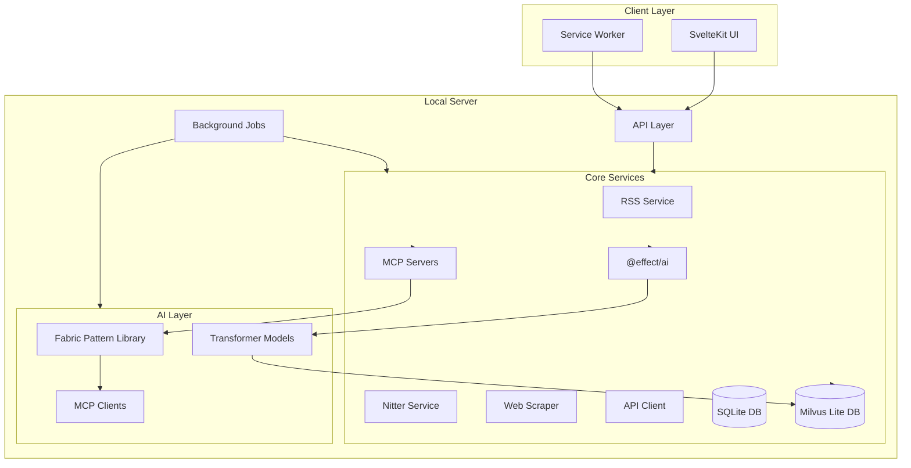
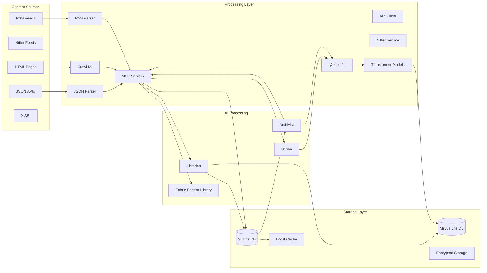
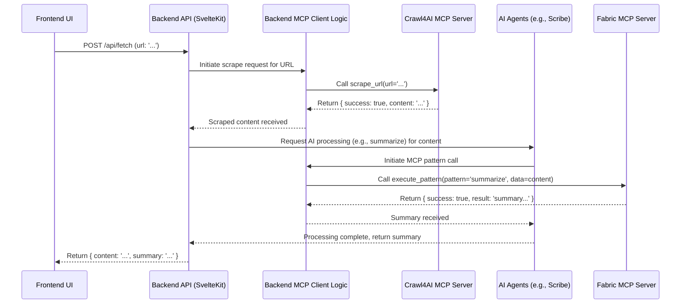
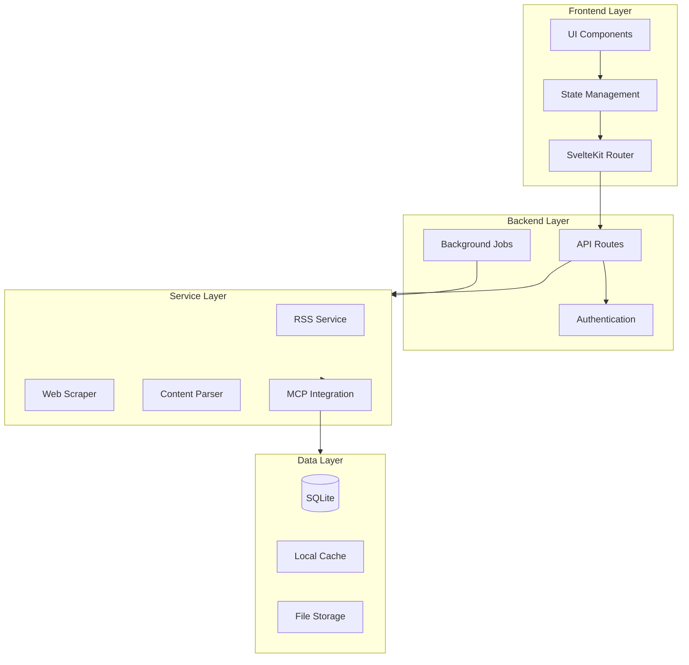

# WebInsight - Technical Specifications

## Overview

WebInsight integrates the Fabric pattern library ([Fabric Patterns](https://github.com/danielmiessler/fabric/tree/main/patterns)) with the Model Context Protocol (MCP) for specialized tools like Crawl4AI, while using transformer models managed by @effect/ai for embedding generation and text processing. This specification details the technical foundation, including transformer integration, Milvus Lite for vector operations, the @effect/ai library for LLM and transformer management, and the UI for configuring these AI capabilities.

## Features

### 1. Content Collection and Processing

#### Web Scraping (Powered by **Crawl4AI MCP Server**)

- Dedicated Python microservice (`Crawl4AI`) implementing an MCP server interface for web crawling and content extraction.
- Uses Playwright for handling JavaScript-heavy sites.
- Processes scraped content with Fabric patterns via MCP (e.g., `summarize`), orchestrated by the main backend or AI agents acting as MCP clients.
- Configurable LLM connections through the LLMProviderService UI (used by the _consumers_ of the scraped content, not Crawl4AI itself).

### 2. AI-Powered Analysis

#### Hybrid CAG/RAG Strategy with Transformers and Milvus Lite

- **Cache-Augmented Generation (CAG)**: Caches AI outputs to reduce redundant computations and improve response times.
- **Retrieval-Augmented Generation (RAG)**: Enhances AI generation with relevant context from the local database using transformer-generated embeddings.
- **Transformer Integration**: Uses models like sentence-transformers/all-MiniLM-L6-v2 for embedding generation, managed by @effect/ai.
- **Milvus Lite**: Lightweight vector database for efficient storage and similarity search of embeddings.
- **Effect.Cache Integration**: Provides type-safe, efficient caching with configurable TTL.
- **Performance Benefits**: Reduces LLM usage, improves response times, and enhances reliability.
- **Quality Improvements**: Semantic similarity search improves relevance and accuracy of AI-generated content.

#### The Archivist Agent

- Uses MCP to pipe content through Fabric pattern library sequences (e.g., `extract_wisdom` → `organize`).
- Generates embeddings using transformer models via @effect/ai.
- Stores embeddings in Milvus Lite for efficient similarity search.
- Leverages the RAG component to enrich metadata extraction with contextual information.

#### The Scribe Agent

- Executes Fabric pattern library operations via MCP for summarization and key point extraction.
- Uses transformer models for text generation tasks like summarization and metadata extraction.
- Uses cached results when available via the CAG component.
- Enhances summaries with context from semantically similar articles via transformer-powered RAG.

#### The Librarian Agent

- Leverages MCP for dynamic recommendation workflows.
- Uses transformer-generated embeddings stored in Milvus Lite for semantic similarity search.
- Implements advanced recommendation algorithms using @effect/ai for functional composition.
- Caches recommendation results to improve performance.

### 3. User Interface and Experience

- LLM Provider UI: SvelteKit component to install and configure LLM providers (local like Ollama, external like OpenAI) and transformer models.
  - Example: Select "Ollama/llama2" for text generation, configure temperature, assign to Scribe.
  - Example: Configure "sentence-transformers/all-MiniLM-L6-v2" for embedding generation via Ollama.
- Server-rendered SvelteKit application
- Responsive Tailwind CSS design
- shadcn-svelte components
- Dark mode support
- Real-time updates via WebSocket with MCP connection status
- Offline-first functionality
- Intuitive content organization with MCP-driven pattern outputs
- Advanced search and filtering enhanced by Fabric patterns

### 4. Data Management and Privacy

- Local SQLite database for structured data storage
- Milvus Lite for vector storage and similarity search
- Efficient data and vector querying
- Automatic backups including vector data
- Import/export capabilities
- Privacy-preserving design with local MCP servers and transformer models
- User data control
- Secure configuration
- Encrypted storage for API credentials
- No reliance on external services for content processing or embedding generation beyond optional LLM providers

### 5. API Integration

- Configurable API source management via MCP
- Support for various API services (X, GitHub, Reddit, etc.) with MCP endpoints
- X API integration via JSON endpoints (e.g., `user_timeline.json`) processed through MCP
- Secure credential storage and encryption
- Rate limit management and scheduling
- User-friendly API configuration interface integrated with MCP UI
- Response parsing and normalization with Fabric patterns
- Local caching of API responses

### 6. Optional Brave Search Integration

#### Core Integration Features

- Privacy-focused web search capabilities
- AI-optimized content enrichment
- Schema-enriched metadata extraction
- Real-time web context integration
- Efficient query management (2,000 free monthly queries)

#### Query Management System

- Intelligent query budget allocation per agent:
  - Archivist: 40% (metadata enrichment, content discovery)
  - Scribe: 35% (content analysis, summarization)
  - Librarian: 25% (recommendations, trends)
- Cache-first strategy with TTL management
- Request batching and deduplication
- Automatic fallback to local processing

#### Integration Tiers

1. **Basic Tier (Free - 2,000 queries/month)**

   - Essential search capabilities
   - Basic metadata enrichment
   - Local cache system
   - Fallback mechanisms

2. **Premium Tier (Optional)**
   - Enhanced AI inference rights
   - Data storage for training
   - Expanded query limits
   - Additional search features (news, video)

#### Fallback Architecture

```typescript
interface HealthCheck {
  checkDatabase(): Promise<HealthStatus>;
  checkVectorDatabase(): Promise<HealthStatus>; // Added for Milvus Lite monitoring
  checkAIServices(): Promise<HealthStatus>;
  checkTransformerModels(): Promise<HealthStatus>; // Added for transformer monitoring
  checkNetworkServices(): Promise<HealthStatus>;
  checkFileSystem(): Promise<HealthStatus>;
  checkMCPServers(): Promise<HealthStatus>; // Added for MCP monitoring
}
```

## Technical Architecture

### Performance Optimization with Hybrid CAG/RAG and Milvus Lite

- **Cache Implementation**: Uses `Effect.Cache` with a capacity of 1000 entries and configurable TTL.
- **Cache Keys**: Structured as `{ articleId, queryType }` for type-safe lookups.
- **Transformer Integration**: Uses sentence-transformers/all-MiniLM-L6-v2 for generating 384-dimensional embeddings.
- **Vector Storage**: Milvus Lite with HNSW indexing for fast similarity search.
- **Context Retrieval**: Uses vector similarity search in Milvus Lite to find semantically relevant articles.
- **Database Schema**:
  - Extended SQLite with `cached_results` table and `embeddingId` field in articles.
  - Milvus Lite collection for storing and indexing embeddings.
- **Invalidation Strategy**: Time-based (TTL) and content-based (article updates) invalidation.
- **User Configuration**: Adjustable TTL settings for both cache and embeddings via preferences UI.

```typescript
// Example cache configuration
const cache = Cache.make({
  lookup: (key) => retrieveOrGenerateContent(key),
  capacity: 1000,
  timeToLive: '1 day'
});
```

### Unified Local Server (SvelteKit/Bun Backend)

- Runtime: Bun for high-performance operations
- Application Server: SvelteKit for frontend and backend logic
- Databases:
  - SQLite with Drizzle ORM for type-safe structured data management
  - Milvus Lite for vector storage and similarity search
- **Crawl4AI MCP Provider**: Logic within the backend implements the MCP provider interface for the Crawl4AI service, exposing web content extraction capabilities as standardized MCP tools.
- **MCP Host**: Central registry for MCP providers that routes tool calls to the appropriate provider and provides a unified API for clients.
- RSS & Nitter: Feed Service with Nitter instance management
- API Integration: Configurable API client service with MCP
- AI Integration:
  - Fabric pattern library with MCP for structured AI tasks
  - Transformer models for embedding generation and text processing
  - @effect/ai for managing LLM interactions and transformer operations
- Real-Time Updates: WebSocket for live notifications including MCP updates
- Background Jobs: Custom scheduler for periodic tasks and API rate limit management
- Programming Paradigm: Functional programming with pure functions and immutable data structures

### External Services / Servers

- **Crawl4AI Service**: Backend service that provides web scraping capabilities, now exposed through the MCP infrastructure for standardized access.
- **Fabric MCP Server(s)**: Servers exposing Fabric pattern library operations.
- **LLM Provider Service**: Direct Effect-based service using @effect/ai for interacting with LLM providers (local like Ollama or external like OpenAI).
- **Transformer Service**: Managed by @effect/ai for embedding generation and text processing using local models via Ollama.

### Frontend Stack

- SvelteKit (server-rendered)
- Tailwind CSS for styling
- shadcn-svelte components
- WebSocket client for MCP status
- Service workers
- Local caching

### Data Layer

- SQLite for structured data persistence with MCP connection schema
- Milvus Lite for vector storage and similarity search
- Extended schema for CAG/RAG strategy with transformer integration:
- **Profile Databases**: Uses the "one profile, one database" model. Each profile's data resides in a dedicated SQLite file (e.g., `~/.config/webinsights/profiles/<profile_id>.db`).
- **CAG/RAG Tables**: Each profile database includes:
  - A `cached_results` table with fields for `articleId`, `queryType`, `result`, `timestamp`, and `ttl`.
  - An `embeddingId` field in the `articles` table referencing vectors in Milvus Lite.
- **Vector Database**: Milvus Lite instance with an `article_embeddings` collection storing 384-dimensional vectors.
- **Profile Metadata**: A central `profiles.json` file or `metadata.db` tracks profile names, database file paths, and encryption status.
- **Optional Encryption**: Private profiles utilize SQLCipher for full database encryption.
  - **Dependency**: Requires the `better-sqlite3-sqlcipher` package (or equivalent Bun-compatible SQLCipher binding) instead of plain `better-sqlite3` for encrypted databases.
  - **Algorithm**: AES-256 (SQLCipher default).
  - **Key Derivation**: User password for private profiles is converted to an encryption key using PBKDF2 (or similar standard KDF) before being passed to SQLCipher.
- In-memory caching
- File system storage
- Data migrations
- **Data Migrations (Custom, On-Load)**:
  - Drizzle ORM defines the schema, but the standard `migrate` function is not used.
  - Migrations are applied when a profile is loaded using a custom script.
  - The script connects (using password if encrypted), reads `__drizzle_migrations`, identifies pending `.sql` files from the `/migrations` folder, executes them via raw SQL, and updates the history table.
  - **Error Handling**: Migration logic for each profile is implemented using the `Effect` library to manage potential errors during connection, SQL execution, or history updates.
- Backup system
- Query optimization
- Immutable data structures
- Pure data transformations

### AI Integration

- Fabric pattern library integration with MCP
- Transformer models for embedding generation and text processing
- @effect/ai for managing LLM interactions and transformer operations
- Shared resource management
- Efficient data passing via MCP servers
- Performance optimization with hybrid CAG/RAG strategy and Milvus Lite
- Context-enhanced AI generation via transformer-powered semantic similarity search
- Result caching for pattern outputs and embeddings
- Background processing of MCP requests
- Model management for both LLMs and transformers through UI

## System Architecture Diagrams

### High-Level System Architecture



### Data Flow Architecture



### Interaction Sequence (Example: Manual Fetch)



### Component Dependencies



## Ethical Considerations

### Data Privacy and User Control

- All data processing happens locally with MCP servers
- Transformer models run locally via Ollama for privacy-preserving embedding generation
- Milvus Lite operates entirely locally without external dependencies
- No data sharing without explicit consent
- User control over AI agent behavior, transformer models, and MCP configurations
- Transparent data collection and usage
- Option to disable AI features, transformer operations, or external MCP connections

### Web Scraping Ethics

- Respect for robots.txt directives
- Rate limiting to prevent server overload
- Proper attribution of content sources
- Cache management to reduce server load
- Ethical content extraction practices with MCP processing

### AI Transparency

- Clear indication of AI-generated content from Fabric pattern library operations
- Explainable AI recommendations via transformer-based similarity search
- User control over AI personalization through MCP and transformer configuration UI
- Bias detection and mitigation in both LLM outputs and embeddings
- Regular AI model updates manageable via MCP and @effect/ai

## Testing and Validation

### Unit Testing

- Component-level tests including MCP and transformer UI
- Service integration tests with MCP servers and Milvus Lite
- AI agent behavior validation with Fabric pattern library operations
- Transformer and embedding validation tests
- Data management verification for both SQLite and Milvus Lite
- Error handling scenarios for MCP connections and vector operations

### Integration Testing

- End-to-end workflow testing with MCP pipelines and transformer operations
- AI agent interaction testing via MCP and @effect/ai
- Performance benchmarking for both SQL and vector operations
- Vector similarity search accuracy testing
- Cross-browser compatibility
- Offline functionality validation

### User Acceptance Testing

- Feature validation with users including MCP UI
- Usability testing
- Performance monitoring
- Accessibility testing
- Security assessment of MCP configurations

### Continuous Integration

- Automated test suites
- Code quality checks
- Performance regression testing
- Security vulnerability scanning for MCP
- Documentation updates

## Installation System

### Desktop Application

- Single executable bundle containing:
  - Bun runtime
  - Application server
  - SQLite database
  - Fabric AI integration with MCP servers
  - Frontend assets
- System tray integration
- Auto-start capability
- Update management

### Configuration

- Configure MCP servers in the settings panel
- Set up LLM providers (Ollama, OpenAI, etc.)
- Configure transformer models for embedding generation
- Set up Milvus Lite connection parameters
- Configure feed sources and update frequencies
- Set privacy preferences
- Customize UI appearance
- Configure vector search parameters (similarity threshold, result count)

### Security

- Local-only access by default
- Process isolation
- Data encryption:
  - SQLCipher (AES-256) for optional, per-profile database encryption.
  - Secure storage for API keys (mechanism TBD, e.g., OS keychain or within encrypted profile DB).
- Secure configuration for MCP
- Permission management

## Development Process

1. Server Setup

   - Bun server configuration
   - Database schema design with MCP tables
   - API development with MCP endpoints
   - Fabric AI integration with MCP
   - WebSocket implementation for MCP updates

2. Frontend Development

   - SvelteKit setup
   - Component library including MCP UI
   - Real-time updates
   - Offline capabilities
   - UI/UX implementation

3. Core Features

   - RSS feed management
   - Content organization with MCP patterns
   - Search functionality enhanced by MCP
   - Data import/export

4. AI Features

   - Content analysis with Fabric patterns via MCP
   - Categorization system
   - Summarization through MCP pipelines
   - Learning system
   - Result caching for MCP outputs

5. Distribution
   - Application bundling
   - Installer creation
   - Auto-update system
   - Documentation
   - Testing suite

## Pilot Implementation

### Diabetes Research Focus

- Pre-configured research profile with MCP patterns
- Curated RSS feeds
- Medical content analysis via Fabric patterns
- Specialized categories
- Terminology handling with MCP sequencing

### Data Sources

- Medical journals
- Clinical trials
- Healthcare organizations
- Patient resources
- Research updates processed through MCP

## Future Enhancements

- Enhanced backup options
- Cross-device synchronization with MCP external connections
- Advanced AI capabilities via Fabric updates
- Collaborative features
- Extended offline support
- Custom analysis templates with MCP UI

## System Requirements

- RAM: 8GB recommended
- Storage: 2GB minimum
- CPU: Multi-core processor
- OS: Cross-platform (Windows, macOS, Linux)
- Internet: Optional for content fetching and external LLM providers

## Project Vision

WebInsight aims to revolutionize content aggregation and analysis, transforming raw web data into meaningful insights through intelligent, user-centric design and advanced AI technologies integrated via MCP.

## Development Resources

### Documentation

- [Architecture Overview](./architecture.md)
- [Project Overview](./project-overview.md)
- [Requirements](./requirements.md)
- [Work in Progress](./work-in-progress.md)
- [CAG/RAG Strategy](./integrations/cag-rag-strategy.md)
- [Transformer & Milvus Code Examples](./integrations/transformer-milvus-code-examples.md)

## Project Roadmap

### Phase 1: Core Infrastructure (Current)

- Basic SvelteKit + Tailwind + shadcn setup
- Database schema and migrations with Drizzle ORM
- Basic RSS feed service implementation
- Initial web scraping service structure
- Basic UI components and theme support

### Phase 2: Feed Management & Web Scraping (In Progress)

🔄 Current Focus:

- [ ] Enhance RSS feed management
  - [ ] Feed collection organization
  - [ ] Feed categorization
  - [ ] Offline reading support
- [x] **Implement Crawl4AI MCP Provider**
  - [x] Define MCP interface for Crawl4AI
  - [x] Implement MCP host for provider registration and tool execution
  - [x] Implement Crawl4AI MCP provider with Effect-based error handling
  - [x] Create API endpoints for MCP tool discovery and execution
  - [x] Implement MCP-based client for Crawl4AI
- [ ] Integrate Crawl4AI MCP results with AI processing
- [ ] Implement LLM Provider Service with @effect/ai
- [x] Ensure Robots.txt compliance (implemented in Crawl4AI MCP provider)

### Phase 3: AI Agents Implementation (Next)

📅 Planned:

- [ ] Integrate MCP with Fabric AI
  - [ ] Pattern library access
  - [ ] UI for LLM provider configuration with @effect/ai integration
- [ ] The Archivist Agent
  - [ ] Content collection system
  - [ ] Metadata extraction with MCP
  - [ ] Content labeling and organization
  - [ ] Context-enhanced metadata extraction with RAG
- [ ] The Scribe Agent
  - [ ] Content summarization via MCP
  - [ ] Key points extraction
  - [ ] Sentiment analysis integration
  - [ ] Performance optimization with CAG
  - [ ] Quality improvement with RAG
- [ ] The Librarian Agent
  - [ ] Content recommendation system
  - [ ] Cross-reference generation
  - [ ] Dynamic content relationships
  - [ ] Metadata-based article retrieval
  - [ ] Recommendation caching with CAG

### Phase 4: Enhanced User Experience

🎯 Future Goals:

- [ ] Advanced search and filtering with MCP
- [ ] Real-time updates via WebSocket
- [ ] Offline-first functionality improvements
- [ ] Performance optimizations
- [ ] Background job processing system with MCP

### Phase 5: Distribution & Polish

🚀 Final Steps:

- [ ] Application bundling
- [ ] Auto-update system
- [ ] Documentation
- [ ] Testing suite
- [ ] Security audits for MCP
- [ ] Performance benchmarking

### Technical Debt & Improvements

🔧 Ongoing:

- [ ] Code documentation
- [ ] Test coverage
- [ ] Error handling for MCP
- [ ] Logging system
- [ ] Performance monitoring

### Timeline Estimates

- Phase 2: 4-6 weeks
- Phase 3: 8-10 weeks
- Phase 4: 4-6 weeks
- Phase 5: 2-4 weeks

Note: Timeline estimates are subject to adjustment based on development progress and priorities.

## Technical Constraints and Considerations

### Profile Management Complexity

- **Migrations**: Applying schema changes across multiple, potentially encrypted databases requires a custom migration script run on profile load, adding complexity compared to single-database migrations.
- **Key Management**: Securely handling user passwords and deriving/using encryption keys for private profiles is critical.

### Web Scraping Limitations

- CORS restrictions require server-side rendering
- Scraping depends on website structure stability
- Performance varies based on target website and MCP processing

### Development Environment

- Runtime: Bun
- Frontend: SvelteKit
- Parsing: Cheerio
- Validation: Zod
- UI Components: shadcn-svelte

## Long-Term Vision

- Cross-platform desktop application
- Advanced machine learning models via MCP
- Community-driven content analysis with Fabric patterns
- Seamless user experience across devices with MCP sync
- UI for crafting own pattern pipelines.

## Specialized Use Cases

- Research-focused feed aggregation
- Professional content monitoring
- Personal knowledge management with MCP-enhanced AI
