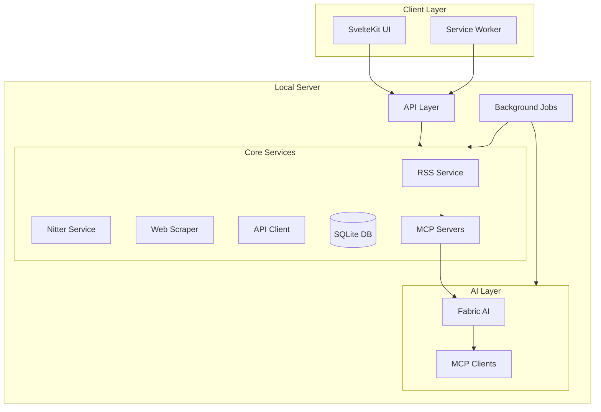
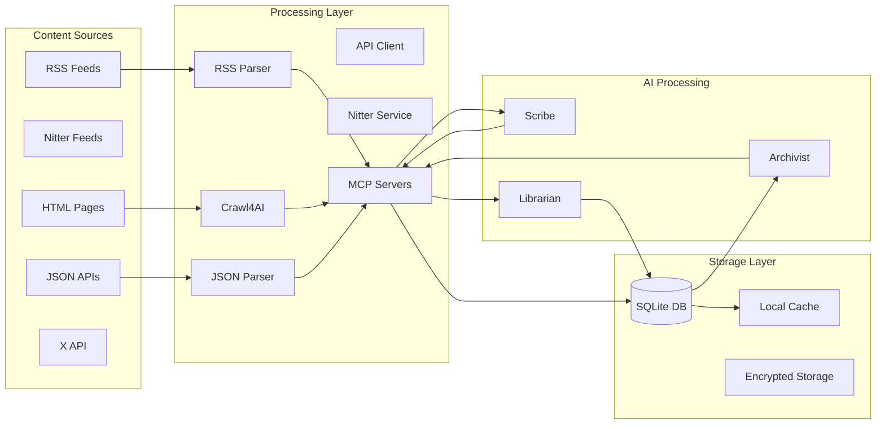
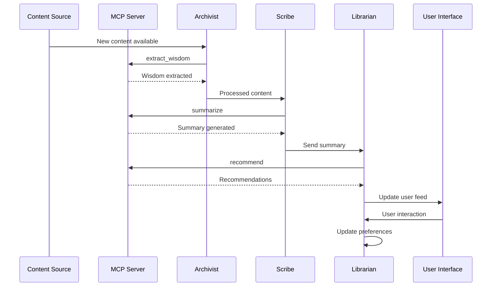
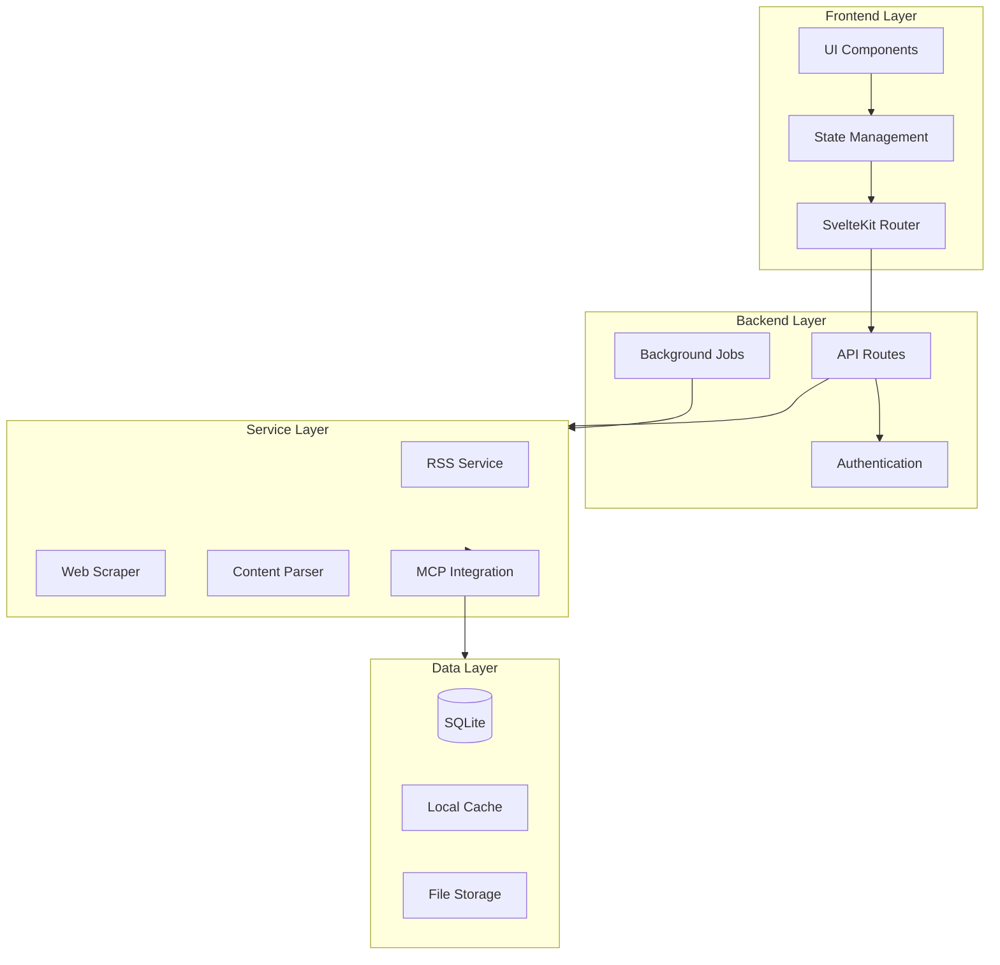

# WebInsight - Technical Specifications

## Overview

WebInsight integrates Fabric AI with the Model Context Protocol (MCP) to enhance web content processing and insight generation. This specification details the technical foundation, including the use of Fabric's pattern library, dynamic LLM sequencing via MCP, and the UI for managing these AI capabilities.

## Features

### 1. Content Collection and Processing

#### Web Scraping (Powered by Crawl4AI + MCP)

- Processes scraped content with Fabric patterns via MCP (e.g., `summarize`).
- Configurable LLM connections through MCP UI.

### 2. AI-Powered Analysis

#### The Archivist Agent

- Uses MCP to pipe content through pattern sequences (e.g., `extract_wisdom` → `organize`).

#### The Scribe Agent

- Executes Fabric patterns via MCP for summarization and key point extraction.

#### The Librarian Agent

- Leverages MCP for dynamic recommendation workflows.

### 3. User Interface and Experience

- MCP UI: SvelteKit component to install and configure LLMs (local like Ollama, external like OpenAI).
  - Example: Select "Ollama/llama2," configure temperature, assign to Scribe.
- Server-rendered SvelteKit application
- Responsive Tailwind CSS design
- shadcn-svelte components
- Dark mode support
- Real-time updates via WebSocket with MCP connection status
- Offline-first functionality
- Intuitive content organization with MCP-driven pattern outputs
- Advanced search and filtering enhanced by Fabric patterns

### 4. Data Management and Privacy

- Local SQLite database with MCP connection table
- Efficient data querying
- Automatic backups
- Import/export capabilities
- Privacy-preserving design with local MCP servers
- User data control
- Secure configuration
- Encrypted storage for API credentials
- No reliance on external services for content processing beyond optional MCP-configured LLMs

### 5. API Integration

- Configurable API source management via MCP
- Support for various API services (X, GitHub, Reddit, etc.) with MCP endpoints
- X API integration via JSON endpoints (e.g., `user_timeline.json`) processed through MCP
- Secure credential storage and encryption
- Rate limit management and scheduling
- User-friendly API configuration interface integrated with MCP UI
- Response parsing and normalization with Fabric patterns
- Local caching of API responses

### 6. Optional Brave Search Integration

#### Core Integration Features

- Privacy-focused web search capabilities
- AI-optimized content enrichment
- Schema-enriched metadata extraction
- Real-time web context integration
- Efficient query management (2,000 free monthly queries)

#### Query Management System

- Intelligent query budget allocation per agent:
  - Archivist: 40% (metadata enrichment, content discovery)
  - Scribe: 35% (content analysis, summarization)
  - Librarian: 25% (recommendations, trends)
- Cache-first strategy with TTL management
- Request batching and deduplication
- Automatic fallback to local processing

#### Integration Tiers

1. **Basic Tier (Free - 2,000 queries/month)**
   - Essential search capabilities
   - Basic metadata enrichment
   - Local cache system
   - Fallback mechanisms

2. **Premium Tier (Optional)**
   - Enhanced AI inference rights
   - Data storage for training
   - Expanded query limits
   - Additional search features (news, video)

#### Fallback Architecture

```typescript
interface BraveSearchFallback {
  mode: 'automatic' | 'manual';
  triggers: {
    quotaExceeded: boolean;
    apiTimeout: number;
    errorThreshold: number;
  };
  strategy: {
    localOnly: boolean;
    hybridProcessing: boolean;
    cacheExtension: number;
  };
}
```

## Technical Architecture

### Unified Local Server

- Runtime: Bun for high-performance operations
- Application Server: SvelteKit for frontend and backend logic
- Database: SQLite with Drizzle ORM for type-safe data management
- Web Scraping: Crawl4AI with MCP for content extraction
- RSS & Nitter: Feed Service with Nitter instance management
- API Integration: Configurable API client service with MCP
- AI Integration: Fabric AI with MCP for pattern execution and LLM management
- Real-Time Updates: WebSocket for live notifications including MCP updates
- Background Jobs: Custom scheduler for periodic tasks and API rate limit management
- Programming Paradigm: Functional programming with pure functions and immutable data structures

### Frontend Stack

- SvelteKit (server-rendered)
- Tailwind CSS for styling
- shadcn-svelte components
- WebSocket client for MCP status
- Service workers
- Local caching

### Data Layer

- SQLite for persistence with MCP connection schema
- **Profile Databases**: Uses the "one profile, one database" model. Each profile's data resides in a dedicated SQLite file (e.g., `~/.config/webinsights/profiles/<profile_id>.db`).
- **Profile Metadata**: A central `profiles.json` file or `metadata.db` tracks profile names, database file paths, and encryption status.
- **Optional Encryption**: Private profiles utilize SQLCipher for full database encryption.
  - **Dependency**: Requires the `better-sqlite3-sqlcipher` package (or equivalent Bun-compatible SQLCipher binding) instead of plain `better-sqlite3` for encrypted databases.
  - **Algorithm**: AES-256 (SQLCipher default).
  - **Key Derivation**: User password for private profiles is converted to an encryption key using PBKDF2 (or similar standard KDF) before being passed to SQLCipher.
- In-memory caching
- File system storage
- Data migrations
- **Data Migrations (Custom, On-Load)**:
  - Drizzle ORM defines the schema, but the standard `migrate` function is not used.
  - Migrations are applied when a profile is loaded using a custom script.
  - The script connects (using password if encrypted), reads `__drizzle_migrations`, identifies pending `.sql` files from the `/migrations` folder, executes them via raw SQL, and updates the history table.
  - **Error Handling**: Migration logic for each profile is implemented using the `Effect` library to manage potential errors during connection, SQL execution, or history updates.
- Backup system
- Query optimization
- Immutable data structures
- Pure data transformations

### AI Integration

- Direct Fabric AI integration with MCP
- Shared resource management
- Efficient data passing via MCP servers
- Result caching for pattern outputs
- Background processing of MCP requests
- Model management through MCP UI

## System Architecture Diagrams

### High-Level System Architecture



### Data Flow Architecture



### AI Agents Interaction



### Component Dependencies



## Ethical Considerations

### Data Privacy and User Control

- All data processing happens locally with MCP servers
- No data sharing without explicit consent
- User control over AI agent behavior and MCP configurations
- Transparent data collection and usage
- Option to disable AI features or external MCP connections

### Web Scraping Ethics

- Respect for robots.txt directives
- Rate limiting to prevent server overload
- Proper attribution of content sources
- Cache management to reduce server load
- Ethical content extraction practices with MCP processing

### AI Transparency

- Clear indication of AI-generated content from Fabric patterns
- Explainable AI recommendations via MCP outputs
- User control over AI personalization through MCP UI
- Bias detection and mitigation
- Regular AI model updates manageable via MCP

## Testing and Validation

### Unit Testing

- Component-level tests including MCP UI
- Service integration tests with MCP servers
- AI agent behavior validation with Fabric patterns
- Data management verification
- Error handling scenarios for MCP connections

### Integration Testing

- End-to-end workflow testing with MCP pipelines
- AI agent interaction testing via MCP
- Performance benchmarking
- Cross-browser compatibility
- Offline functionality validation

### User Acceptance Testing

- Feature validation with users including MCP UI
- Usability testing
- Performance monitoring
- Accessibility testing
- Security assessment of MCP configurations

### Continuous Integration

- Automated test suites
- Code quality checks
- Performance regression testing
- Security vulnerability scanning for MCP
- Documentation updates

## Installation System

### Desktop Application

- Single executable bundle containing:
  - Bun runtime
  - Application server
  - SQLite database
  - Fabric AI integration with MCP servers
  - Frontend assets
- System tray integration
- Auto-start capability
- Update management

### Configuration

- Initial setup wizard with MCP LLM selection
- LLM provider selection and installation via UI
- API key management for external MCP connections
- Port configuration for MCP servers
- Resource limits
- Backup settings

### Security

- Local-only access by default
- Process isolation
- Data encryption:
  - SQLCipher (AES-256) for optional, per-profile database encryption.
  - Secure storage for API keys (mechanism TBD, e.g., OS keychain or within encrypted profile DB).
- Secure configuration for MCP
- Permission management

## Development Process

1. Server Setup
   - Bun server configuration
   - Database schema design with MCP tables
   - API development with MCP endpoints
   - Fabric AI integration with MCP
   - WebSocket implementation for MCP updates

2. Frontend Development
   - SvelteKit setup
   - Component library including MCP UI
   - Real-time updates
   - Offline capabilities
   - UI/UX implementation

3. Core Features
   - RSS feed management
   - Content organization with MCP patterns
   - Search functionality enhanced by MCP
   - Data import/export

4. AI Features
   - Content analysis with Fabric patterns via MCP
   - Categorization system
   - Summarization through MCP pipelines
   - Learning system
   - Result caching for MCP outputs

5. Distribution
   - Application bundling
   - Installer creation
   - Auto-update system
   - Documentation
   - Testing suite

## Pilot Implementation

### Diabetes Research Focus

- Pre-configured research profile with MCP patterns
- Curated RSS feeds
- Medical content analysis via Fabric patterns
- Specialized categories
- Terminology handling with MCP sequencing

### Data Sources

- Medical journals
- Clinical trials
- Healthcare organizations
- Patient resources
- Research updates processed through MCP

## Future Enhancements

- Enhanced backup options
- Cross-device synchronization with MCP external connections
- Advanced AI capabilities via Fabric updates
- Collaborative features
- Extended offline support
- Custom analysis templates with MCP UI

## System Requirements

- RAM: 8GB recommended
- Storage: 2GB minimum
- CPU: Multi-core processor
- OS: Cross-platform (Windows, macOS, Linux)
- Internet: Optional for content fetching and external MCP LLMs

## Project Vision

WebInsight aims to revolutionize content aggregation and analysis, transforming raw web data into meaningful insights through intelligent, user-centric design and advanced AI technologies integrated via MCP.

## Project Roadmap

### Phase 1: Core Infrastructure (Current)

✅ Completed:

- Basic SvelteKit + Tailwind + shadcn setup
- Database schema and migrations with Drizzle ORM
- Basic RSS feed service implementation
- Initial web scraping service structure
- Basic UI components and theme support

### Phase 2: Feed Management & Web Scraping (In Progress)

🔄 Current Focus:

- [ ] Enhance RSS feed management
  - [ ] Feed collection organization
  - [ ] Feed categorization
  - [ ] Offline reading support
- [ ] Implement Crawl4AI with MCP
  - [ ] MCP pattern integration
  - [ ] LLM sequencing support
  - [ ] Robots.txt compliance

### Phase 3: AI Agents Implementation (Next)

📅 Planned:

- [ ] Integrate MCP with Fabric AI
  - [ ] Pattern library access
  - [ ] UI for LLM configuration
- [ ] The Archivist Agent
  - [ ] Content collection system
  - [ ] Metadata extraction with MCP
  - [ ] Content labeling and organization
- [ ] The Scribe Agent
  - [ ] Content summarization via MCP
  - [ ] Key points extraction
  - [ ] Sentiment analysis integration
- [ ] The Librarian Agent
  - [ ] Content recommendation system
  - [ ] Cross-reference generation
  - [ ] Dynamic content relationships

### Phase 4: Enhanced User Experience

🎯 Future Goals:

- [ ] Advanced search and filtering with MCP
- [ ] Real-time updates via WebSocket
- [ ] Offline-first functionality improvements
- [ ] Performance optimizations
- [ ] Background job processing system with MCP

### Phase 5: Distribution & Polish

🚀 Final Steps:

- [ ] Application bundling
- [ ] Auto-update system
- [ ] Documentation
- [ ] Testing suite
- [ ] Security audits for MCP
- [ ] Performance benchmarking

### Technical Debt & Improvements

🔧 Ongoing:

- [ ] Code documentation
- [ ] Test coverage
- [ ] Error handling for MCP
- [ ] Logging system
- [ ] Performance monitoring

### Timeline Estimates

- Phase 2: 4-6 weeks
- Phase 3: 8-10 weeks
- Phase 4: 4-6 weeks
- Phase 5: 2-4 weeks

Note: Timeline estimates are subject to adjustment based on development progress and priorities.

## Technical Constraints and Considerations

### Profile Management Complexity

- **Migrations**: Applying schema changes across multiple, potentially encrypted databases requires a custom migration script run on profile load, adding complexity compared to single-database migrations.
- **Key Management**: Securely handling user passwords and deriving/using encryption keys for private profiles is critical.

### Web Scraping Limitations

- CORS restrictions require server-side rendering
- Scraping depends on website structure stability
- Performance varies based on target website and MCP processing

### Development Environment

- Runtime: Bun
- Frontend: SvelteKit
- Parsing: Cheerio
- Validation: Zod
- UI Components: shadcn-svelte

## Long-Term Vision

- Cross-platform desktop application
- Advanced machine learning models via MCP
- Community-driven content analysis with Fabric patterns
- Seamless user experience across devices with MCP sync
- UI for crafting own pattern pipelines.

## Specialized Use Cases

- Research-focused feed aggregation
- Professional content monitoring
- Personal knowledge management with MCP-enhanced AI
