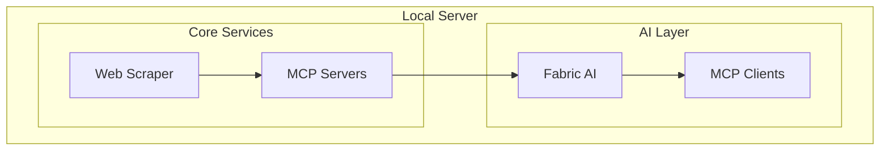
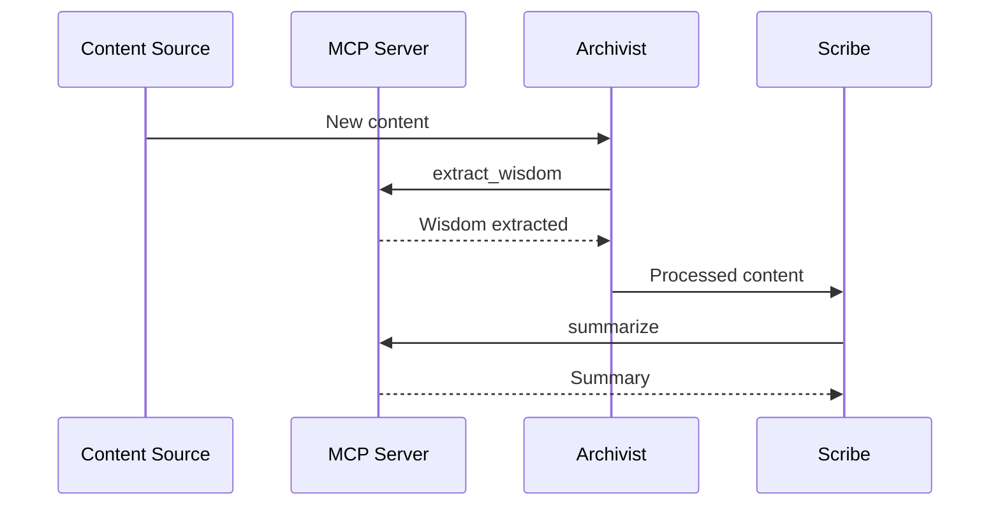

# Integration Plan for Crawl4AI in Flux RSS Fabric AI

## 1. Overview

Crawl4AI is an open-source LLM-friendly web crawler and scraper that provides optimized content extraction for AI applications. This integration enhances our Web Scraping Service within the Smart RSS Aggregator App, now leveraging the Model Context Protocol (MCP) to interface with Fabric AI's pattern library and LLM capabilities.

### Key Advantages with MCP

1. **LLM-Optimized Output**: Enhanced by Fabric's pattern library (e.g., `summarize`, `extract_wisdom`) via MCP.
2. **Performance Features**: MCP servers streamline data access, supporting local-first operation.
3. **Advanced Capabilities**: Dynamic pattern sequencing (e.g., extract then summarize) via MCP pipelines.

## 2. Architecture Integration

### 2.1 Core Components

1. **WebScrapingService with Crawl4AI and MCP**
   - Pure functional wrappers now integrate MCP clients for LLM interactions.
   - Key Improvements:
     - MCP endpoints for pattern execution (e.g., `mcp://patterns/summarize`).
     - Type-safe configuration with Zod schemas extended for MCP settings.

2. **Functional Error Handling with MCP**

```typescript
static async scrape(
  config: z.infer<typeof ScraperConfigSchema>
): Promise<Either<ScrapingError, z.infer<typeof ScraperResultSchema>>> {
  try {
    const validatedConfig = ScraperConfigSchema.parse(config);
    const result = validatedConfig.useCrawl4AI
      ? await this.scrapWithCrawl4AI(validatedConfig)
      : await this.scrapeWithDefault(validatedConfig);

    // Pipe through MCP for Fabric pattern processing
    const mcpResult = await mcp.executePattern('summarize', result.content, validatedConfig.llmUrl);
    return right({ ...result, processedContent: mcpResult });
  } catch (error) {
    return left(this.transformError(error));
  }
}
```

3. **Crawl4AI Client with MCP**
   - MCP clients connect to local or external LLMs for content extraction.

### 2.2 Key Functional Programming Principles Applied

- **Immutability**: Extended to MCP configuration objects.
- **Composition**: MCP pipelines compose scraping and pattern execution.

### 2.3 Performance and Reliability Enhancements

- **MCP Integration**: Local MCP servers cache LLM outputs, enhancing efficiency.

## 3. Implementation Steps

### Phase 1: Core Integration (2 weeks)

1. **Setup and Configuration**
   - Install Crawl4AI and Fabric CLI: `pip install -U crawl4ai` and `go install github.com/danielmiessler/fabric@latest`.
   - Configure MCP servers for Fabric patterns and LLMs.

2. **Basic Extraction with MCP**
   - Use MCP to pipe Crawl4AI output through Fabric patterns (e.g., `extract_wisdom`).

## 4. Technical Implementation Details

### 4.1 Extraction Strategies

1. **Content Filtering and Markdown Generation with MCP**

```python
def create_content_filter(options):
  filter = BM25ContentFilter(user_query=options.get('query', ''))
  return mcp.registerPattern('filter_content', filter)  # Expose via MCP
```

2. **LLM-based Extraction with Fabric**

```python
from crawl4ai.extraction_strategy import LlmExtractionStrategy

def create_llm_extraction_strategy(prompt, options=None):
  return LlmExtractionStrategy(
    prompt=prompt,
    mcp_url=f"mcp://localhost:11434/{options.get('model', 'default')}"  # MCP endpoint
  )
```

## 6. Integration with AI Agents

- **The Scribe Agent**: Uses MCP to sequence patterns (e.g., `extract_wisdom` → `summarize`).
- **UI**: Configures MCP connections for LLMs via SvelteKit interface.

## 7. User Configuration Interface

- **MCP Settings**: UI to install LLMs (e.g., Ollama) and configure pattern sequences.

---

# Smart RSS Aggregator App - Detailed Architecture

## Overview

The Smart RSS Aggregator App leverages Fabric AI with the Model Context Protocol (MCP) for intelligent content processing, integrating Fabric's pattern library and LLM sequencing.

## Core Architecture Layers

### 2. Backend Layer (Bun + SvelteKit)

#### Core Services

2. **Web Scraping Service (Crawl4AI + MCP)**

- Extracts content and pipes it through MCP for Fabric pattern processing.

```typescript
interface WebScrapingService {
  extractContent(url: string, selectors: SelectorConfig): Promise<ScrapedContent>;
  processWithMCP(content: ScrapedContent, pattern: string): Promise<ProcessedContent>;
}
```

4. **API Client Service with MCP**
   - Configures MCP connections to external LLMs.

```typescript
interface ApiClientService {
  configureMCPConnection(config: MCPConfig): Promise<MCPConnection>;
}
```

### 3. AI Layer (Fabric AI + MCP)

#### Agent Architecture

1. **The Archivist**

```typescript
interface ArchivistAgent {
  processContent(source: ContentSource, patternSequence: string[]): Promise<Content>;
}
```

- Uses MCP to sequence patterns (e.g., `extract_metadata` → `organize`).

2. **The Scribe**
   - Executes Fabric patterns via MCP for summarization and analysis.

3. **The Librarian**
   - Leverages MCP pipelines for recommendation generation.

### 4. Data Layer

#### Database Schema (SQLite + Drizzle ORM)

```typescript
interface MCPConnection {
  id: string;
  url: string;          // e.g., mcp://localhost:11434/llama2
  vendor: string;       // e.g., ollama, openai
  model: string;
  status: ConnectionStatus;
}
```

### 5. Integration Layer

#### WebSocket Communication

```typescript
interface WebSocketEvents {
  'mcp:update': (connectionId: string) => void;
}
```

#### Performance Optimization

##### Caching Strategy

1. **Multi-level Cache with MCP**

```typescript
interface CacheManager {
  mcpCache: MCPCache;  // Cache for MCP LLM outputs
}
```

---

# Smart RSS Aggregator App Specification

## Overview

The Smart RSS Aggregator App integrates Fabric AI with MCP to enhance content processing using Fabric's pattern library, dynamic LLM sequencing, and a UI for LLM management.

## Features

### 1. Content Collection and Processing

#### Web Scraping (Powered by Crawl4AI + MCP)

- Processes scraped content with Fabric patterns via MCP (e.g., `summarize`).
- Configurable LLM connections through MCP UI.

### 2. AI-Powered Analysis

#### The Archivist Agent

- Uses MCP to pipe content through pattern sequences (e.g., `extract_wisdom` → `organize`).

#### The Scribe Agent

- Executes Fabric patterns via MCP for summarization and key point extraction.

#### The Librarian Agent

- Leverages MCP for dynamic recommendation workflows.

### 3. User Interface and Experience

- **MCP UI**: SvelteKit component to install and configure LLMs (local like Ollama, external like OpenAI).
  - Example: Select "Ollama/llama2," configure temperature, assign to Scribe.

## Technical Architecture

### Unified Local Server

- **AI Integration**: Fabric AI with MCP for pattern execution and LLM management.
- **UI Stack**: Extended with `LLMManager.svelte` for MCP configuration.

## System Architecture Diagrams

### High-Level System Architecture



### AI Agents Interaction



## Project Roadmap

### Phase 2: Feed Management & Web Scraping (In Progress)

- [ ] Implement Crawl4AI with MCP
  - [ ] MCP pattern integration
  - [ ] LLM sequencing support

### Phase 3: AI Agents Implementation (Next)

- [ ] Integrate MCP with Fabric AI
  - [ ] Pattern library access
  - [ ] UI for LLM configuration
