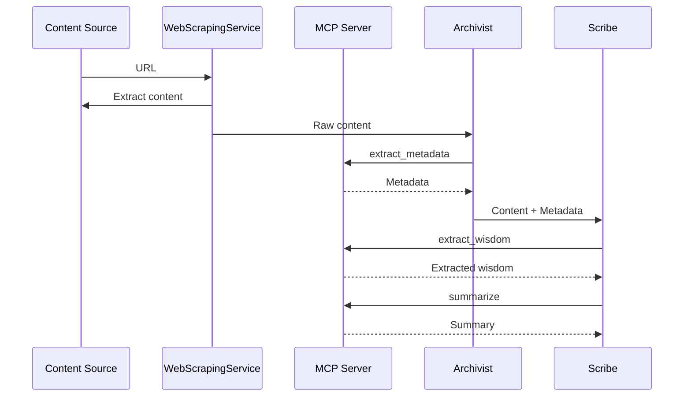
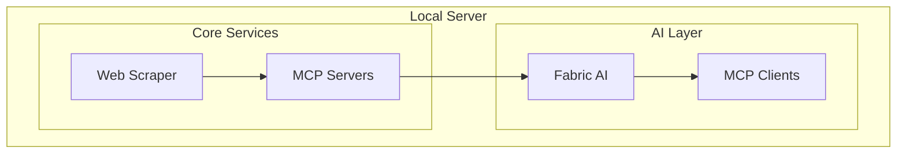
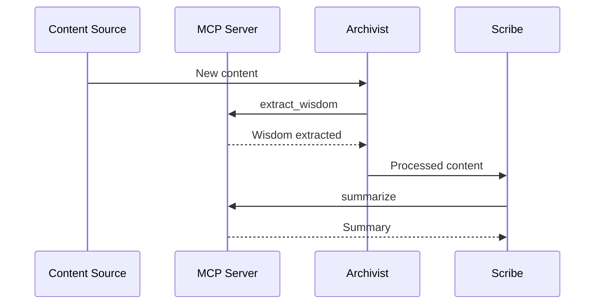

# Integration Plan for Crawl4AI in Flux RSS Fabric AI

## 1. Overview

Crawl4AI is an open-source LLM-friendly web crawler and scraper that provides optimized content extraction for AI applications. This integration enhances our Web Scraping Service within the Flux RSS Fabric AI project, leveraging the Model Context Protocol (MCP) to interface with Fabric AI's pattern library and LLM capabilities.

### Current Implementation Status

The Crawl4AI service (v0.1.0) has been successfully implemented and tested as a Python microservice with FastAPI. It provides robust content extraction capabilities, including:

- Browser-based extraction using Playwright for dynamic websites
- CSS selector-based content targeting
- Comprehensive error handling and fallback mechanisms
- Robots.txt compliance checking
- Integration with the TypeScript client using Effect for functional programming

### Key Advantages with MCP

1. **LLM-Optimized Output**: Enhanced by Fabric's pattern library (e.g., `summarize`, `extract_wisdom`) via MCP.
2. **Performance Features**: MCP servers streamline data access, supporting local-first operation.
3. **Advanced Capabilities**: Dynamic pattern sequencing (e.g., extract then summarize) via MCP pipelines.

## 1. Overview

Crawl4AI is an open-source, LLM-friendly web crawler and scraper that provides optimized content extraction for AI applications. In Flux RSS Fabric AI, Crawl4AI powers the Web Scraping Service, and is being integrated with the Model Context Protocol (MCP) to leverage Fabric AI's pattern library and LLM capabilities.

### Key Advantages with MCP

1. **LLM-Optimized Output**: Fabric pattern library (e.g., `summarize`, `extract_wisdom`) is accessible via MCP for advanced content transformation.
2. **Performance & Local-first**: MCP servers streamline data access, enable local-first operation, and support efficient caching.
3. **Composable Pipelines**: Dynamic pattern sequencing (e.g., extract → summarize) via MCP pipelines, all expressed in a functional, compositional way.

## 2. Architecture Integration

### 2.1 Core Components (Implemented & Planned)

**We have successfully implemented the following Crawl4AI v0.5.0 features in our integration:**

- ✅ **Browser Automation:** Implemented Playwright integration for dynamic websites with JavaScript execution.
- ✅ **Custom Schemas:** Added support for extracting structured data using CSS selectors.
- ✅ **Dynamic Crawling:** Implemented JS execution, waiting for selectors, and custom JavaScript execution.
- ✅ **Advanced Caching:** Integrated Crawl4AI's caching system to avoid redundant fetches.
- ✅ **Comprehensive Testing:** Added robust unit and integration tests with special handling for test URLs.
- ✅ **Error Handling:** Implemented comprehensive error handling and fallback mechanisms.

**Features planned for future implementation:**

- **Media Extraction:** Extract images, audio, video, and responsive formats for richer content summaries.
- **Screenshots:** Capture page screenshots for debugging, content previews, or AI vision models.
- **Custom Hooks:** Integrate custom hooks for pre/post-processing and content transformation.
- **JWT Authentication:** Secure the FastAPI microservice for trusted integrations.
- **Cloud & Docker Deploy:** Support scalable, production-ready deployments.

**Core Components:**

1. **WebScrapingService (TypeScript, Effect-based)** ✅
   - Pure functional wrappers for Crawl4AI using Effect.
   - Type-safe, schema-driven configuration (Effect Schema).
   - Supports both direct Crawl4AI extraction and browser-based extraction.

2. **Crawl4AI Python Service (v0.1.0)** ✅
   - FastAPI microservice for content extraction and robots.txt compliance.
   - Markdown and structured extraction, content filtering, and caching.
   - **Successfully implemented browser automation using Playwright** to handle dynamic, JS-heavy sites.
   - Comprehensive error handling and fallback mechanisms.
   - Robust unit and integration tests.

3. **MCPClient & FabricAIScrapingService (TypeScript)** 🔄
   - Effect-based MCP client for pattern execution, sequencing, and LLM management.
   - Functional error handling and compositional pattern pipelines.

4. **UI Integration (Planned)** ⏳
   - SvelteKit-based LLM Manager component for configuring MCP servers, LLMs, and pattern assignments.

### 2.2 Functional Programming Principles

- **Immutability**: All configuration and state objects are immutable.
- **Composition**: Scraping, extraction, and pattern execution are composed via Effect pipelines.
- **Type Safety**: Schemas enforce correctness at every layer (TypeScript & Python).

### 2.3 Performance and Reliability Enhancements

- **MCP Caching**: Local MCP servers cache LLM outputs for efficiency and offline use.
- **Service Layer Isolation**: Clear separation between scraping, pattern execution, and agent logic.

## 3. Implementation Roadmap

### Phase 1: Core Crawl4AI Integration (Completed)

- [x] WebScrapingService (TS): Orchestrates scraping, delegates to Crawl4AI for extraction.
- [x] Crawl4AI Python microservice (v0.1.0): Handles core extraction, robots.txt, filtering.
- [x] **Successfully integrated Playwright** into the Python service for browser automation to handle dynamic, JS-heavy sites.
- [x] Implemented config flag in TS service to request browser-based scraping from Python.
- [x] Completed TypeScript client integration (Effect-based, schema-driven).
- [x] Implemented WebScrapingService with Crawl4AI fallback mechanisms.
- [x] Added comprehensive unit and integration tests for both TypeScript and Python components.
- [x] Fixed integration tests with special handling for test URLs.
- [x] Documented usage and configuration in both TS and Python services.
- [x] Ensured all browser-based logic remains isolated in Python, keeping TS service pure and composable.

### Phase 2: MCP Integration (In Progress)

- [x] MCPClient and FabricAIScrapingService scaffolding.
- [ ] MCP server configuration and pattern registration.
- [ ] Pattern sequencing and compositional pipelines.
- [ ] UI for LLM and pattern management.

### Phase 3: Advanced Features (Planned)

- [ ] Media extraction capabilities (images, audio, video)
- [ ] Screenshot capture for debugging and previews
- [ ] Custom hooks for pre/post-processing
- [ ] JWT authentication for secure API access
- [ ] Cloud and Docker deployment support
- [ ] Performance optimization and scaling

## 4. Testing Strategy

### Implemented Testing

- **Unit Tests**: Test individual functions and components in isolation using mocks.
- **Integration Tests**: Verify that the service works correctly as a whole with actual HTTP requests.
- **Test Runner**: Provides a convenient way to run all tests with options for unit-only, integration-only, and server auto-start.

### Future Testing Plans

- **Performance Testing**: Measure response times and resource usage under load.
- **Security Testing**: Verify that the service is secure against common vulnerabilities.
- **End-to-End Testing**: Test the entire system from UI to backend services.

---


- [x] Crawl4AI Python microservice (core extraction, robots.txt, filtering)
- [x] TypeScript client integration (Effect-based, schema-driven)
- [x] WebScrapingService with Crawl4AI fallback
- [x] MCPClient and FabricAIScrapingService scaffolding
- [ ] MCP server configuration and pattern registration
- [ ] Pattern sequencing and compositional pipelines
- [ ] UI for LLM and pattern management

### Phase 2: AI Agent Architecture (Planned)

- [ ] Archivist Agent: Content collection, metadata extraction, organization (via MCP pattern sequences)
- [ ] Scribe Agent: Summarization, wisdom extraction, quality assessment (MCP pipelines)
- [ ] Librarian Agent: Recommendation, cross-reference, user interaction (MCP pipelines)

### Phase 3: Performance & UX

- [ ] Multi-level cache for MCP/LLM outputs
- [ ] Parallel/concurrent pattern execution
- [ ] UI for pattern/LLM assignment and monitoring

## 4. Technical Implementation Details

### 4.1 Extraction & Pattern Execution

- **Content Filtering/Markdown**: BM25 and pruning filters, markdown generation, all exposed as composable functions.
- **Pattern Execution**: MCPClient executes single or sequenced patterns, returning structured results.
- **Agent Integration**: Agents (Archivist, Scribe, Librarian) invoke MCPClient pipelines for advanced content analysis and organization.

### 4.2 Example: Functional Pattern Pipeline

```typescript
// Scribe Agent: wisdom extraction → summarization
const analysis = Effect.gen(function* ($) {
  const extracted = yield* $(WebScrapingService.scrape({ ... }));
  const result = yield* $(MCPClient.executePatternSequence([
    'extract_wisdom',
    'summarize',
  ], extracted.content, mcpConfig));
  return result;
});
```

### 4.3 UI/Configuration (Planned)

- SvelteKit LLM Manager: discover/install LLMs, assign patterns, monitor status.
- User can assign LLMs/patterns to agents (Archivist, Scribe, Librarian) via UI.

## 5. System Architecture & Agents

- **WebScrapingService**: Composable, functional API for content extraction.
- **MCPClient**: Pure functions for pattern execution and LLM management.
- **Agents**: Functional composition of scraping, extraction, and pattern pipelines.



## 6. Next Steps & Open Items

- [ ] Complete MCP server and pattern registration
- [ ] Implement pattern sequencing and agent pipelines
- [ ] Build LLM Manager UI for configuration/monitoring
- [ ] Finalize agent implementations (Archivist, Scribe, Librarian)
- [ ] Optimize for caching, concurrency, and offline use

---

This plan reflects the current implementation, clarifies what is in progress, and preserves all unimplemented but necessary features to achieve the privacy-first, AI-powered RSS experience.

```typescript
static async scrape(
  config: z.infer<typeof ScraperConfigSchema>
): Promise<Either<ScrapingError, z.infer<typeof ScraperResultSchema>>> {
  try {
    const validatedConfig = ScraperConfigSchema.parse(config);
    const result = validatedConfig.useCrawl4AI
      ? await this.scrapWithCrawl4AI(validatedConfig)
      : await this.scrapeWithDefault(validatedConfig);

    // Pipe through MCP for Fabric pattern processing
    const mcpResult = await mcp.executePattern('summarize', result.content, validatedConfig.llmUrl);
    return right({ ...result, processedContent: mcpResult });
  } catch (error) {
    return left(this.transformError(error));
  }
}
```

3. **Crawl4AI Client with MCP**
   - MCP clients connect to local or external LLMs for content extraction.

### 2.2 Key Functional Programming Principles Applied

- **Immutability**: Extended to MCP configuration objects.
- **Composition**: MCP pipelines compose scraping and pattern execution.

### 2.3 Performance and Reliability Enhancements

- **MCP Integration**: Local MCP servers cache LLM outputs, enhancing efficiency.

## 3. Implementation Steps

### Phase 1: Core Integration (2 weeks)

1. **Setup and Configuration**
   - Install Crawl4AI and Fabric CLI: `pip install -U crawl4ai` and `go install github.com/danielmiessler/fabric@latest`.
   - Configure MCP servers for Fabric patterns and LLMs.

2. **Basic Extraction with MCP**
   - Use MCP to pipe Crawl4AI output through Fabric patterns (e.g., `extract_wisdom`).

## 4. Technical Implementation Details

### 4.1 Extraction Strategies

1. **Content Filtering and Markdown Generation with MCP**

```python
def create_content_filter(options):
  filter = BM25ContentFilter(user_query=options.get('query', ''))
  return mcp.registerPattern('filter_content', filter)  # Expose via MCP
```

2. **LLM-based Extraction with Fabric**

```python
from crawl4ai.extraction_strategy import LlmExtractionStrategy

def create_llm_extraction_strategy(prompt, options=None):
  return LlmExtractionStrategy(
    prompt=prompt,
    mcp_url=f"mcp://localhost:11434/{options.get('model', 'default')}"  # MCP endpoint
  )
```

## 6. Integration with AI Agents

- **The Scribe Agent**: Uses MCP to sequence patterns (e.g., `extract_wisdom` → `summarize`).
- **UI**: Configures MCP connections for LLMs via SvelteKit interface.

## 7. User Configuration Interface

- **MCP Settings**: UI to install LLMs (e.g., Ollama) and configure pattern sequences.

---

# Smart RSS Aggregator App - Detailed Architecture

## Overview

The Smart RSS Aggregator App leverages Fabric AI with the Model Context Protocol (MCP) for intelligent content processing, integrating Fabric's pattern library and LLM sequencing.

## Core Architecture Layers

### 2. Backend Layer (Bun + SvelteKit)

#### Core Services

2. **Web Scraping Service (Crawl4AI + MCP)**

- Extracts content and pipes it through MCP for Fabric pattern processing.

```typescript
interface WebScrapingService {
  extractContent(url: string, selectors: SelectorConfig): Promise<ScrapedContent>;
  processWithMCP(content: ScrapedContent, pattern: string): Promise<ProcessedContent>;
}
```

4. **API Client Service with MCP**
   - Configures MCP connections to external LLMs.

```typescript
interface ApiClientService {
  configureMCPConnection(config: MCPConfig): Promise<MCPConnection>;
}
```

### 3. AI Layer (Fabric AI + MCP)

#### Agent Architecture

1. **The Archivist**

```typescript
interface ArchivistAgent {
  processContent(source: ContentSource, patternSequence: string[]): Promise<Content>;
}
```

- Uses MCP to sequence patterns (e.g., `extract_metadata` → `organize`).

2. **The Scribe**
   - Executes Fabric patterns via MCP for summarization and analysis.

3. **The Librarian**
   - Leverages MCP pipelines for recommendation generation.

### 4. Data Layer

#### Database Schema (SQLite + Drizzle ORM)

```typescript
interface MCPConnection {
  id: string;
  url: string;          // e.g., mcp://localhost:11434/llama2
  vendor: string;       // e.g., ollama, openai
  model: string;
  status: ConnectionStatus;
}
```

### 5. Integration Layer

#### WebSocket Communication

```typescript
interface WebSocketEvents {
  'mcp:update': (connectionId: string) => void;
}
```

#### Performance Optimization

##### Caching Strategy

1. **Multi-level Cache with MCP**

```typescript
interface CacheManager {
  mcpCache: MCPCache;  // Cache for MCP LLM outputs
}
```

---

# Smart RSS Aggregator App Specification

## Overview

The Smart RSS Aggregator App integrates Fabric AI with MCP to enhance content processing using Fabric's pattern library, dynamic LLM sequencing, and a UI for LLM management.

## Features

### 1. Content Collection and Processing

#### Web Scraping (Powered by Crawl4AI + MCP)

- Processes scraped content with Fabric patterns via MCP (e.g., `summarize`).
- Configurable LLM connections through MCP UI.

### 2. AI-Powered Analysis

#### The Archivist Agent

- Uses MCP to pipe content through pattern sequences (e.g., `extract_wisdom` → `organize`).

#### The Scribe Agent

- Executes Fabric patterns via MCP for summarization and key point extraction.

#### The Librarian Agent

- Leverages MCP for dynamic recommendation workflows.

### 3. User Interface and Experience

- **MCP UI**: SvelteKit component to install and configure LLMs (local like Ollama, external like OpenAI).
  - Example: Select "Ollama/llama2," configure temperature, assign to Scribe.

## Technical Architecture

### Unified Local Server

- **AI Integration**: Fabric AI with MCP for pattern execution and LLM management.
- **UI Stack**: Extended with `LLMManager.svelte` for MCP configuration.

## System Architecture Diagrams

### High-Level System Architecture



### AI Agents Interaction



## Project Roadmap

### Phase 2: Feed Management & Web Scraping (In Progress)

- [ ] Implement Crawl4AI with MCP
  - [ ] MCP pattern integration
  - [ ] LLM sequencing support

### Phase 3: AI Agents Implementation (Next)

- [ ] Integrate MCP with Fabric AI
  - [ ] Pattern library access
  - [ ] UI for LLM configuration
