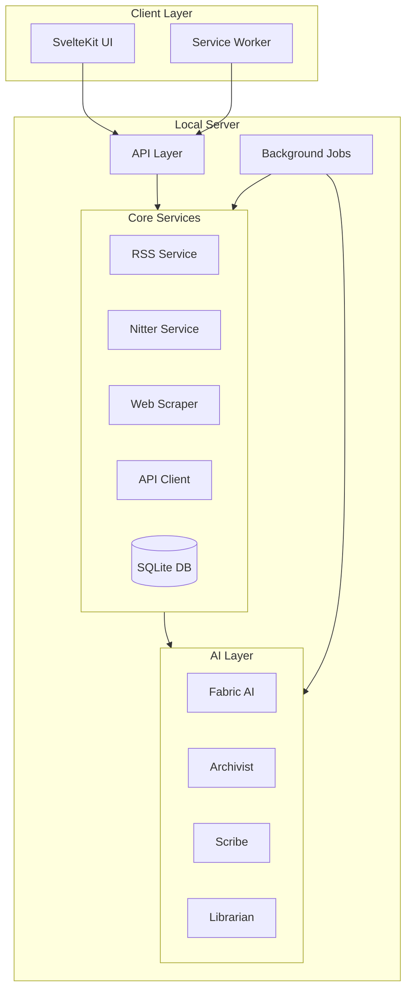
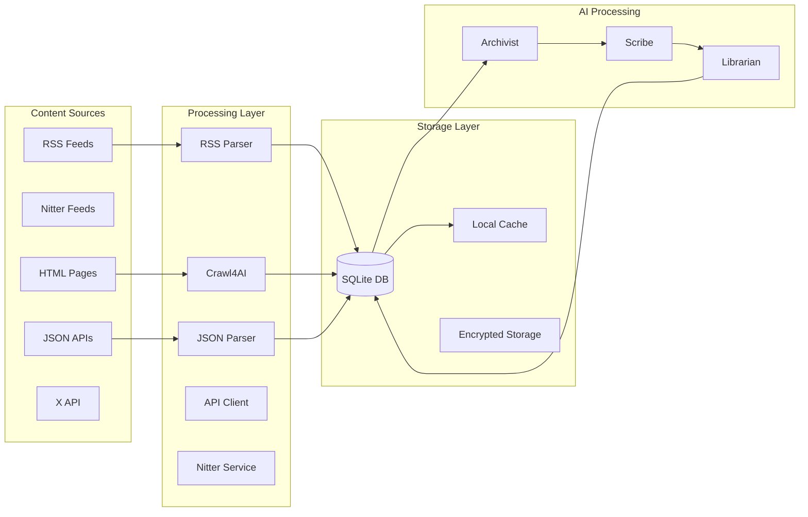
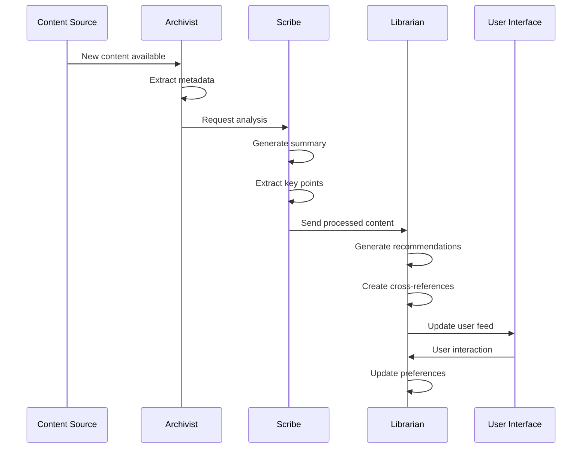
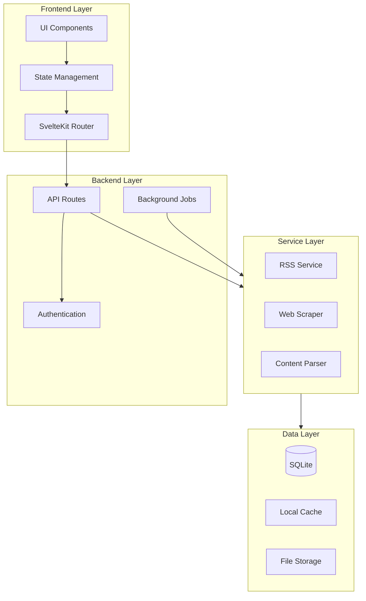

# Smart RSS Aggregator App Specification

## Overview

The **Smart RSS Aggregator App** is a local-first application designed to enhance content consumption through intelligent RSS feed aggregation and AI-powered analysis. Built with **Bun** and **SvelteKit**, it operates via a unified local server, ensuring user privacy, data ownership, and full offline functionality. The app extends beyond traditional RSS aggregation by incorporating **web scraping and HTML/JSON parsing**, leveraging **Crawl4AI** for robust content extraction. Powered by **Fabric AI**, it features three specialized AI agents—**the Archivist**, **the Scribe**, and **the Librarian**—to collect, summarize, and organize content into a personalized knowledge hub.

## Core Principles

### Local-First Approach

- Single local server architecture
- All data stored locally
- Complete functionality without internet
- User owns and controls all their data
- Privacy-focused design

### Functional Programming Paradigm

- Pure functions with minimal side effects
- Immutable data structures
- Function composition over imperative procedures
- Declarative code style
- Higher-order functions and transformations
- Separation of data and behavior
- Predictable state management

### AI-Driven Intelligence

- Three specialized AI agents working in harmony
- Intelligent content processing and organization
- Personalized recommendations and insights
- Privacy-preserving AI operations

### User-Centric Design

- Intuitive interface for content management
- Seamless integration of AI features
- Customizable content organization
- Focus on user privacy and control

## Features

### 1. Content Collection and Processing

#### RSS Feed Management

- Fetch and parse RSS feeds
- Create named collections
- Support various content types
- Folder organization
- Local storage of feeds
- Offline reading capability

#### Nitter Integration for X Content

- Fetch X account RSS feeds via Nitter instances (e.g., `https://nitter.net/{username}/rss`)
- Maintain and manage a list of Nitter instances
- Implement fallback mechanism to cycle through instances when one fails
- Handle instance-specific quirks (e.g., lowercase username requirements)
- Automatic retry and error recovery
- Local caching of feed content to maintain offline-first approach

#### Web Scraping (Powered by Crawl4AI)

- HTML content extraction
- JSON data parsing
- User-configurable scraping strategies and rules
- Strict robots.txt compliance and ethical scraping practices
- Intelligent rate limiting and throttling
- Local caching of scraped content
- Fallback mechanisms for content extraction
- Error handling and recovery strategies
- Resource-efficient operation with adjustable settings
- Privacy-preserving local processing

### 2. AI-Powered Analysis

#### The Archivist Agent

- Content collection from multiple sources
- Metadata extraction and enrichment
- Intelligent content labeling
- Automated organization
- Content relationship mapping

#### The Scribe Agent

- Content summarization
- Key points extraction
- Sentiment analysis
- Scientific content vulgarization
- Reading time estimation
- Content quality assessment

#### The Librarian Agent

- Content recommendation system
- Cross-reference generation
- Dynamic content relationships
- User preference learning
- Collection organization suggestions
- Content discovery assistance

### 3. User Interface and Experience

- Server-rendered SvelteKit application
- Responsive Tailwind CSS design
- shadcn-svelte components
- Dark mode support
- Real-time updates
- Offline-first functionality
- Intuitive content organization
- Advanced search and filtering

### 4. Data Management and Privacy

- Local SQLite database
- Efficient data querying
- Automatic backups
- Import/export capabilities
- Privacy-preserving design
- User data control
- Secure configuration
- Encrypted storage for API credentials
- No reliance on external services for content processing

### 5. API Integration

- Configurable API source management
- Support for various API services (X, GitHub, Reddit, etc.)
- X API integration via JSON endpoints (e.g., `user_timeline.json`)
- Secure credential storage and encryption
- Rate limit management and scheduling
- User-friendly API configuration interface
- Response parsing and normalization
- Local caching of API responses

## Technical Architecture

### Unified Local Server

- **Runtime**: Bun for high-performance operations
- **Application Server**: SvelteKit for frontend and backend logic
- **Database**: SQLite with Drizzle ORM for type-safe data management
- **Web Scraping**: Crawl4AI for content extraction
- **RSS & Nitter**: Feed Service with Nitter instance management
- **API Integration**: Configurable API client service
- **AI Integration**: Fabric AI for analysis and processing (with adjustable processing depth)
- **Real-Time Updates**: WebSocket for live notifications
- **Background Jobs**: Custom scheduler for periodic tasks and API rate limit management
- **Programming Paradigm**: Functional programming with pure functions and immutable data structures

### Frontend Stack

- SvelteKit (server-rendered)
- Tailwind CSS for styling
- shadcn-svelte components
- WebSocket client
- Service workers
- Local caching

### Data Layer

- SQLite for persistence
- In-memory caching
- File system storage
- Data migrations
- Backup system
- Query optimization
- Immutable data structures
- Pure data transformations

### AI Integration

- Direct Fabric AI integration
- Shared resource management
- Efficient data passing
- Result caching
- Background processing
- Model management

## System Architecture Diagrams

### High-Level System Architecture

### Data Flow Architecture

### AI Agents Interaction

### Component Dependencies

## Ethical Considerations

### Data Privacy and User Control

- All data processing happens locally
- No data sharing without explicit consent
- User control over AI agent behavior
- Transparent data collection and usage
- Option to disable AI features

### Web Scraping Ethics

- Respect for robots.txt directives
- Rate limiting to prevent server overload
- Proper attribution of content sources
- Cache management to reduce server load
- Ethical content extraction practices

### AI Transparency

- Clear indication of AI-generated content
- Explainable AI recommendations
- User control over AI personalization
- Bias detection and mitigation
- Regular AI model updates

## Testing and Validation

### Unit Testing

- Component-level tests
- Service integration tests
- AI agent behavior validation
- Data management verification
- Error handling scenarios

### Integration Testing

- End-to-end workflow testing
- AI agent interaction testing
- Performance benchmarking
- Cross-browser compatibility
- Offline functionality validation

### User Acceptance Testing

- Feature validation with users
- Usability testing
- Performance monitoring
- Accessibility testing
- Security assessment

### Continuous Integration

- Automated test suites
- Code quality checks
- Performance regression testing
- Security vulnerability scanning
- Documentation updates

## Installation System

### Desktop Application

- Single executable bundle containing:
  - Bun runtime
  - Application server
  - SQLite database
  - Fabric AI integration
  - Frontend assets
- System tray integration
- Auto-start capability
- Update management

### Configuration

- Initial setup wizard
- LLM provider selection
- API key management
- Port configuration
- Resource limits
- Backup settings

### Security

- Local-only access
- Process isolation
- Data encryption
- Secure configuration
- Permission management

## Development Process

1. Server Setup
   - Bun server configuration
   - Database schema design
   - API development
   - Fabric AI integration
   - WebSocket implementation

2. Frontend Development
   - SvelteKit setup
   - Component library
   - Real-time updates
   - Offline capabilities
   - UI/UX implementation

3. Core Features
   - RSS feed management
   - Content organization
   - Search functionality
   - Data import/export

4. AI Features
   - Content analysis
   - Categorization system
   - Summarization
   - Learning system
   - Result caching

5. Distribution
   - Application bundling
   - Installer creation
   - Auto-update system
   - Documentation
   - Testing suite

## Pilot Implementation

### Diabetes Research Focus

- Pre-configured research profile
- Curated RSS feeds
- Medical content analysis
- Specialized categories
- Terminology handling

### Data Sources

- Medical journals
- Clinical trials
- Healthcare organizations
- Patient resources
- Research updates

## Future Enhancements

- Enhanced backup options
- Cross-device synchronization
- Advanced AI capabilities
- Collaborative features
- Extended offline support
- Custom analysis templates

## System Requirements

- **RAM**: 8GB recommended
- **Storage**: 2GB minimum
- **CPU**: Multi-core processor
- **OS**: Cross-platform (Windows, macOS, Linux)
- **Internet**: Optional for content fetching

## Project Vision

Flux RSS Fabric AI aims to revolutionize content aggregation and analysis through intelligent, user-centric design and advanced AI technologies.

## Project Roadmap

### Phase 1: Core Infrastructure (Current)

✅ Completed:

- Basic SvelteKit + Tailwind + shadcn setup
- Database schema and migrations with Drizzle ORM
- Basic RSS feed service implementation
- Initial web scraping service structure
- Basic UI components and theme support

### Phase 2: Feed Management & Web Scraping (In Progress)

🔄 Current Focus:

- [ ] Enhance RSS feed management
  - [ ] Feed collection organization
  - [ ] Feed categorization
  - [ ] Offline reading support
- [ ] Implement Crawl4AI integration
  - [ ] HTML content extraction
  - [ ] JSON data parsing
  - [ ] Rate limiting and caching
  - [ ] Robots.txt compliance

### Phase 3: AI Agents Implementation (Next)

📅 Planned:

- [ ] The Archivist Agent
  - [ ] Content collection system
  - [ ] Metadata extraction
  - [ ] Content labeling and organization
- [ ] The Scribe Agent
  - [ ] Content summarization
  - [ ] Key points extraction
  - [ ] Sentiment analysis integration
- [ ] The Librarian Agent
  - [ ] Content recommendation system
  - [ ] Cross-reference generation
  - [ ] Dynamic content relationships

### Phase 4: Enhanced User Experience

🎯 Future Goals:

- [ ] Advanced search and filtering
- [ ] Real-time updates via WebSocket
- [ ] Offline-first functionality improvements
- [ ] Performance optimizations
- [ ] Background job processing system

### Phase 5: Distribution & Polish

🚀 Final Steps:

- [ ] Application bundling
- [ ] Auto-update system
- [ ] Documentation
- [ ] Testing suite
- [ ] Security audits
- [ ] Performance benchmarking

### Technical Debt & Improvements

🔧 Ongoing:

- [ ] Code documentation
- [ ] Test coverage
- [ ] Error handling
- [ ] Logging system
- [ ] Performance monitoring

### Timeline Estimates

- Phase 2: 4-6 weeks
- Phase 3: 8-10 weeks
- Phase 4: 4-6 weeks
- Phase 5: 2-4 weeks

Note: Timeline estimates are subject to adjustment based on development progress and priorities.

## Technical Constraints and Considerations

### Web Scraping Limitations

- CORS restrictions require server-side rendering
- Scraping depends on website structure stability
- Performance varies based on target website

### Development Environment

- Runtime: Bun
- Frontend: SvelteKit
- Parsing: Cheerio
- Validation: Zod
- UI Components: shadcn-svelte

## Long-Term Vision

- Cross-platform desktop application
- Advanced machine learning models
- Community-driven content analysis
- Seamless user experience across devices

## Specialized Use Cases

- Research-focused feed aggregation
- Professional content monitoring
- Personal knowledge management
