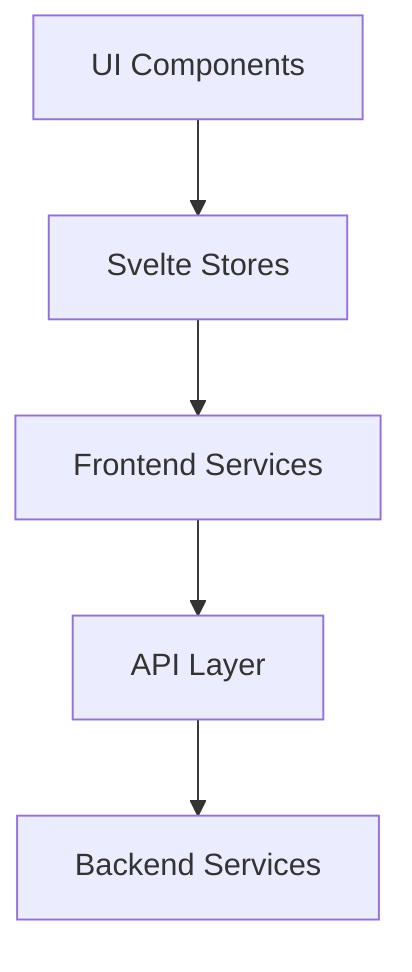
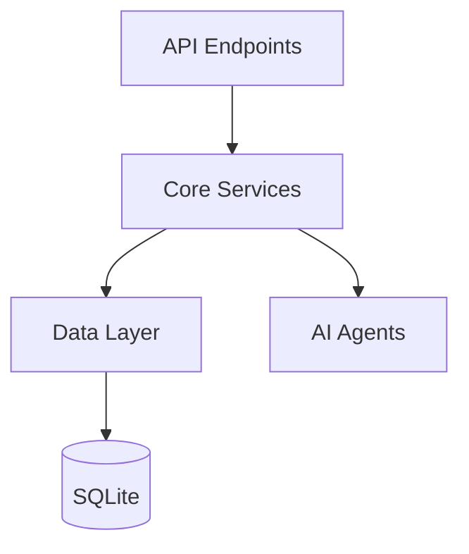

# System Patterns

## Architecture Overview

### Frontend Architecture (SvelteKit)

### Backend Architecture (Bun + SvelteKit)

## Design Patterns

### Functional Programming Patterns
- Pure functions
- Immutable data structures
- Function composition
- Higher-order functions
- Effect management
- Data transformation pipelines

### Component Patterns
- Atomic design
- Smart/Dumb components
- Component composition
- State management via stores
- Event-driven updates
- Reactive patterns

### Data Patterns
- Repository pattern
- Unit of work
- Data mappers
- Immutable entities
- Event sourcing
- CQRS principles

### AI Agent Patterns
- Agent composition
- Message passing
- State machines
- Observer pattern
- Strategy pattern
- Chain of responsibility

## System Components

### Frontend Components
- UI Components (shadcn-svelte)
- Feed Components
- Content Components
- AI Components
- Store Management
- Service Layer

### Backend Services
- Feed Service
- Nitter Service
- Web Scraping Service
- API Client Service
- Background Job Service
- AI Agent Services

### Data Layer
- Drizzle ORM
- SQLite Database
- Migration System
- Query Builders
- Type Definitions
- Schema Management

### AI Architecture
1. Archivist Agent
   - Content collection
   - Metadata extraction
   - Organization

2. Scribe Agent
   - Content analysis
   - Summarization
   - Quality assessment

3. Librarian Agent
   - Recommendations
   - Cross-references
   - User interaction 