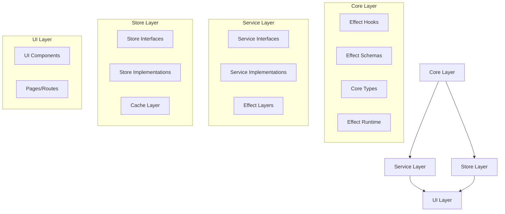
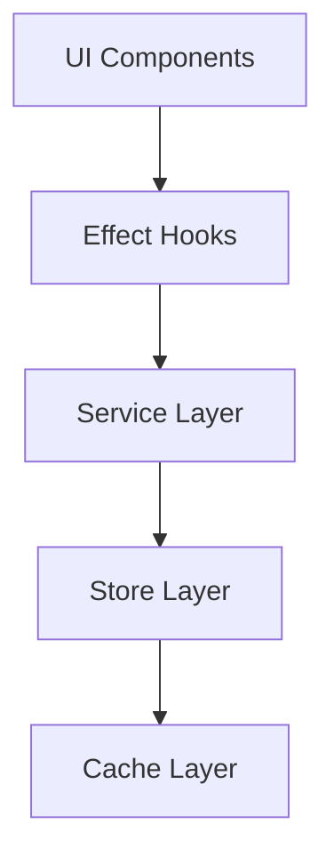
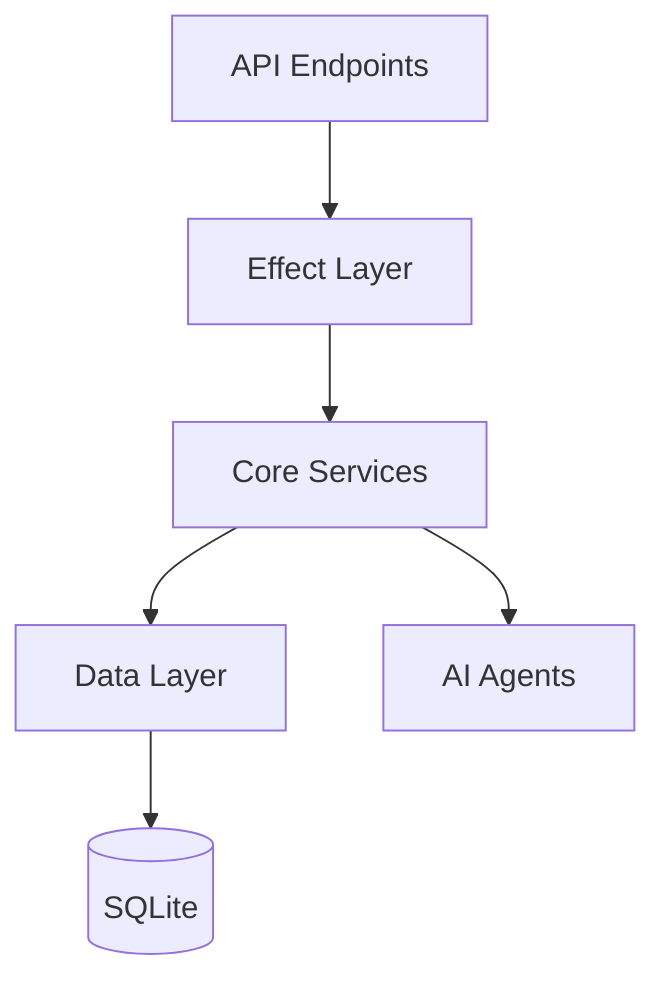

# System Patterns

## Architecture Overview

### Effect-Based Architecture

### Frontend Architecture (SvelteKit)

### Backend Architecture (Bun + SvelteKit)

## Design Patterns

### Effect Patterns
- Effect-based error handling
- Dependency injection via Effect
- Service Layer pattern with Effect
- Store Layer with caching
- Effect composition
- Effect runtime configuration

### Functional Programming Patterns
- Pure functions
- Immutable data structures
- Function composition
- Higher-order functions
- Effect management
- Data transformation pipelines

### Testing Patterns (TypeScript)
- Effect-based testing using `@effect/vitest`
- Vitest framework for test execution
- Mocking dependencies (e.g., `effectFetch`) using `vi.mock`
- Unit testing Effect services and functions
- Utilizing `Effect.gen` and `pipe` for test structure
- Global test setup (`src/tests/setup.ts`) for runtime resets (`Effect.resetRuntime()`)

### Testing Patterns (Python Microservices)
- Pytest framework for test execution
- Virtual environment (`venv`) for dependency isolation
- Unit tests (`tests/test_unit.py`) using `unittest.mock` and `fastapi.testclient.TestClient`
- Integration tests (`tests/test_integration.py`) interacting with running service
- Test runner script (`run_tests.py`) for managing test execution

### Component Patterns
- Atomic design
- Smart/Dumb components
- Component composition
- Effect-based state management
- Event-driven updates
- Reactive patterns

### Data Patterns
- Repository pattern with Effect
- Unit of work
- Data mappers
- Immutable entities
- Event sourcing
- CQRS principles

### AI Agent Patterns
- Effect-based agent composition
- Message passing
- State machines
- Observer pattern
- Strategy pattern
- Chain of responsibility

### Microservice Pattern
- Separate Python/FastAPI service (e.g., Crawl4AI) for specific tasks
- TypeScript client library (`Crawl4AIClient`) for interaction
- Clear API contract between main application and microservice

## System Components

### Core Layer
- Effect definitions
- Error handling system
- Runtime configuration
- Schema validation
- Type definitions
- Utility functions

### Service Layer
- Service interfaces
- Effect-based implementations
- Dependency injection
- Error handling
- Resource management
- API integrations

### Store Layer
- Store interfaces
- Cache management
- State persistence
- Effect-based operations
- Type-safe access
- Reactive updates

### Frontend Components
- UI Components (shadcn-svelte)
- Feed Components
- Content Components
- AI Components
- Effect Hooks
- Service Integration

### Backend Services
- Feed Service
- Nitter Service
- Web Scraping Service
- API Client Service
- Background Job Service
- AI Agent Services

### Data Layer
- Drizzle ORM
- SQLite Database
- Migration System
- Query Builders
- Type Definitions
- Schema Management

### AI Architecture
1. Archivist Agent
   - Content collection
   - Metadata extraction
   - Organization

2. Scribe Agent
   - Content analysis
   - Summarization
   - Quality assessment

3. Librarian Agent
   - Recommendations
   - Cross-references
   - User interaction 